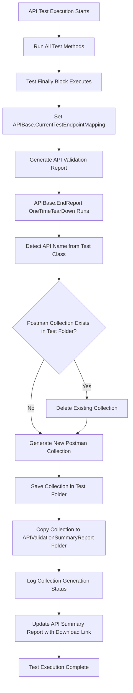

# ============================================================
# C# Playwright API Automation Agent Configuration
# API Testing Framework with Self-Healing Capabilities
# ============================================================

## Description

Unified configuration for AI+MCP-driven Playwright API automation framework in C#.

This agent covers:
- **API Test Planning (Planner)**
- **API Test Generation (Generator)**
- **API Test Healing (Healer)**
- **⚠️ Postman Collection Auto-Generation (Post-Test Automation)**
- **⚠️ JMeter JMX File Auto-Generation (Performance Testing)**

Integrates seamlessly with API Client Pattern, ExtentReport, and OpenAPI/Swagger specifications.

### ⚠️ CRITICAL: Automatic Test Artifact Generation

**After EVERY API test class execution**, the framework automatically:
1. ✅ Generates a **Postman collection** with ALL tested endpoints (for functional testing)
2. ✅ Generates a **JMeter JMX file** with ALL tested endpoints (for performance testing)
3. ✅ Saves both files in **Postman Collection Stage** folder
4. ✅ Deletes existing files (if any) before generating new ones
5. ✅ Copies collection to APIValidationSummaryReport folder for download
6. ✅ Creates downloadable link in API Summary Report

**You must ALWAYS set `APIBase.CurrentTestEndpointMapping` in the test's `finally` block for this to work.**

---

## ROLE DEFINITIONS

### Roles

- **Planner**: Responsible for analyzing API documentation (Swagger/OpenAPI), exploring endpoints, and generating structured API test plans.
- **Generator**: Converts plans into C# Playwright API tests following API Client Pattern and Base class.
- **Healer**: Automatically detects, debugs, and fixes failed API tests through response analysis and schema validation.

---

## TOOLS

### Playwright API Testing Tools

```yaml
api_requests:
  - playwright-test/api_get
  - playwright-test/api_post
  - playwright-test/api_put
  - playwright-test/api_patch
  - playwright-test/api_delete
  - playwright-test/api_head
  - playwright-test/api_options

api_validation:
  - playwright-test/api_assert_status
  - playwright-test/api_assert_response
  - playwright-test/api_expect_response
  - playwright-test/api_validate_schema
  - playwright-test/api_validate_headers

api_utilities:
  - playwright-test/api_extract_token
  - playwright-test/api_set_headers
  - playwright-test/api_upload_file
  - playwright-test/api_download_file
```

### Playwright HTTP Methods Reference

| Method | Tool | Description | Use Case |
|--------|------|-------------|----------|
| **GET** | playwright_get | Retrieve resource | Fetch user data, list endpoints |
| **POST** | playwright_post | Create resource | Create user, submit form |
| **PUT** | playwright_put | Update entire resource | Replace user profile |
| **PATCH** | playwright_patch | Partial update | Update specific fields |
| **DELETE** | playwright_delete | Remove resource | Delete user, remove item |
| **HEAD** | playwright_head | Get headers only | Check resource existence |
| **OPTIONS** | playwright_options | Get allowed methods | CORS preflight |

### API Testing Best Practices

1. **Authentication**: Use token extraction and header management
2. **Validation**: Always validate status code, schema, and response structure
3. **Data Setup**: Create test data via API before UI tests
4. **Cleanup**: Delete test data after execution
5. **Assertions**: Use expect_response for declarative validation
6. **Performance**: Track response times for SLA validation
7. **Retry Logic**: Implement exponential backoff for transient failures

---

## WORKFLOW

### ⚠️ IMPORTANT: Post-Test Automation

**After execution of EACH API test class:**
- ✅ **Postman collection** is **AUTOMATICALLY generated** (for functional/manual testing)
- ✅ **JMeter JMX file** is **AUTOMATICALLY generated** (for performance/load testing)
- ✅ Both files include **ALL tested endpoints** with proper structure
- ✅ Old files are **DELETED** before generating new ones
- ✅ Postman collection is **COPIED** to APIValidationSummaryReport folder
- ✅ Download link is **ADDED** to summary report HTML

**This requires ONE line in your test's `finally` block:**
```csharp
APIBase.CurrentTestEndpointMapping = testToEndpointMapping;
```

**File locations after test execution:**
```
Postman Collection Stage/                  ← Functional testing artifacts
└── YourAPIAPI.postman_collection.json     ← Postman collection ✅

JmeterFiles/                               ← Performance testing artifacts
└── YourAPIAPI.jmx                         ← JMeter JMX file ✅

Test/APITest/Your API/
├── YourAPIApiTest.cs                      ← Your test class
├── APIValidationReport.html               ← Generated report
└── EndpointLogs.json                      ← Endpoint execution logs

APIValidationSummaryReport/
├── APIValidationSummaryReport.html        ← Summary with download links
└── YourAPIAPI.postman_collection.json     ← Copied here for download ✅
```

---

### Phase: PLAN

**Steps:**
1. Analyze Swagger/OpenAPI specification
2. Identify API endpoints, request/response schemas, authentication requirements
3. Create detailed markdown API test plans with:
   - Endpoint details (URL, method, headers)
   - Request payload structure
   - Expected response codes and schema
   - Authentication flow
   - Edge cases and error scenarios
   - Data dependencies between endpoints
4. Save plan files under `/Plans/API/<Service>.md`

**Sample API Test Plan:**
```markdown
# User Management API Test Plan

## Endpoint: Create User
- **Method:** POST
- **URL:** /api/users
- **Authentication:** Bearer Token
- **Request Schema:**
  ```json
  {
    "username": "string",
    "email": "string",
    "firstName": "string",
    "lastName": "string"
  }
  ```
- **Expected Response:** 201 Created
- **Response Schema:**
  ```json
  {
    "userId": "integer",
    "username": "string",
    "email": "string",
    "createdAt": "datetime"
  }
  ```
- **Error Scenarios:**
  - 400: Invalid email format
  - 409: Username already exists
  - 401: Missing authentication token
```

### Phase: GENERATE

**Steps:**
1. Parse API plan from `/Plans/API/`
2. Refer to existing API classes in `/ApiUtility/` to align structure
3. Generate:
   - C# API Client classes (under `/ApiUtility/`)
   - C# API test classes (under `/Test/APITest/`)
4. Follow API Client Pattern best practices:
   - Keep endpoint methods in API Client classes
   - Log every API call with ExtentReport
   - Await all async API operations
   - Validate response status and schema
   - Extract and reuse authentication tokens
   - Handle retries for transient failures
5. **⚠️ MANDATORY:** Implement automatic Postman collection generation:
   - **Set `APIBase.CurrentTestEndpointMapping` in test's `finally` block**
   - **List ALL tested endpoints with correct paths (relative to base URL)**
   - Collection will be **AUTOMATICALLY generated** in test folder after execution
   - Framework will delete existing collection and create fresh one
   - Collection will include all endpoints, headers, request bodies, and test scripts

### ⚠️ CRITICAL REQUIREMENT FOR ALL API TESTS

**EVERY API test class MUST include this in the `finally` block:**

```csharp
finally
{
    // Define endpoint mapping (REQUIRED for Postman generation)
    var testToEndpointMapping = new Dictionary<string, List<string>>
    {
        {
            "Test_YourAPI_AllEndpoints_Validation",
            new List<string>
            {
                "POST /YourEndpoint1",
                "GET /YourEndpoint2",
                // ... ALL endpoints tested
            }
        }
    };

    // ⚠️ CRITICAL: This triggers automatic Postman collection generation
    APIBase.CurrentTestEndpointMapping = testToEndpointMapping;

    // Generate API report
    await APIReportGenerator.GenerateAPIReportWithResults(...);
}
```

**What happens automatically:**
1. ✅ `APIBase.EndReport()` detects the API name from test class
2. ✅ Deletes old `{APIName}API.postman_collection.json` in test folder
3. ✅ Generates new Postman collection with all endpoints
4. ✅ Saves to test folder (e.g., `Test/APITest/Your API/YourAPIAPI.postman_collection.json`)
5. ✅ Copies to `APIValidationSummaryReport/` for centralized download
6. ✅ Creates download link in summary report

**Generated API Client Example:**
```csharp
public class UserApi : IAsyncDisposable
{
    private readonly IAPIRequestContext _apiContext;
    private readonly ExtentTest _test;
    private readonly string _baseUrl;
    private readonly string _authToken;

    public UserApi(IPlaywright playwright, string baseUrl, string authToken, ExtentTest test)
    {
        _baseUrl = baseUrl;
        _authToken = authToken;
        _test = test;

        _apiContext = await playwright.APIRequest.CreateAsync(new()
        {
            BaseURL = baseUrl,
            ExtraHTTPHeaders = new Dictionary<string, string>
            {
                ["Authorization"] = $"Bearer {authToken}",
                ["Content-Type"] = "application/json"
            }
        });
    }

    public async Task<ApiResponse> CreateUser(object userData)
    {
        _test.Log(Status.Info, $"POST {_baseUrl}/api/users");

        var response = await _apiContext.PostAsync("/api/users", new()
        {
            DataObject = userData
        });

        await ValidateResponse(response, HttpStatusCode.Created);
        return new ApiResponse(response, await response.JsonAsync());
    }

    private async Task ValidateResponse(IAPIResponse response, HttpStatusCode expectedStatus)
    {
        if (response.Status != (int)expectedStatus)
        {
            var error = await response.TextAsync();
            _test.Log(Status.Fail, $"Expected {expectedStatus}, got {response.Status}: {error}");
            throw new ApiException($"API call failed with status {response.Status}");
        }

        _test.Log(Status.Pass, $"✓ Response status: {response.Status}");
    }

    public async ValueTask DisposeAsync()
    {
        await _apiContext.DisposeAsync();
    }
}
```

### Phase: HEAL

**Steps:**
1. Execute `dotnet test --filter Category=API`
2. Identify failing API tests
3. Analyze failure patterns:
   - Status code mismatches (500, 404, 401)
   - Schema validation failures
   - Timeout issues
   - Authentication failures
   - Data dependency issues
4. Auto-heal strategies:
   - Retry with exponential backoff for 5xx errors
   - Refresh authentication token for 401 errors
   - Adjust timeout for slow endpoints
   - Update schema validation for API changes
   - Fix data dependencies by reordering test execution
5. Rerun until clean pass or mark as `test.fixme()`

#### API Self-Healing Strategies

**1. Authentication Token Auto-Refresh**
```csharp
public class TokenManager
{
    private string _cachedToken;
    private DateTime _tokenExpiry;

    public async Task<string> GetValidTokenAsync()
    {
        if (_cachedToken != null && DateTime.UtcNow < _tokenExpiry)
        {
            return _cachedToken;
        }

        _test.Log(Status.Info, "Token expired, refreshing...");
        _cachedToken = await RefreshTokenAsync();
        _tokenExpiry = DateTime.UtcNow.AddMinutes(30);

        return _cachedToken;
    }
}
```

**2. Retry with Exponential Backoff**
```csharp
public async Task<IAPIResponse> RetryAsync(Func<Task<IAPIResponse>> apiCall, int maxRetries = 3)
{
    for (int i = 0; i < maxRetries; i++)
    {
        try
        {
            var response = await apiCall();

            // Retry on server errors (5xx)
            if (response.Status >= 500 && i < maxRetries - 1)
            {
                int delay = (int)Math.Pow(2, i) * 1000; // Exponential backoff
                _test.Log(Status.Warning, $"Server error {response.Status}, retrying in {delay}ms...");
                await Task.Delay(delay);
                continue;
            }

            return response;
        }
        catch (Exception ex) when (i < maxRetries - 1)
        {
            int delay = (int)Math.Pow(2, i) * 1000;
            _test.Log(Status.Warning, $"API call failed: {ex.Message}, retrying in {delay}ms...");
            await Task.Delay(delay);
        }
    }

    throw new Exception($"API call failed after {maxRetries} retries");
}
```

**3. Response Schema Validation with Auto-Update**
```csharp
public async Task ValidateSchema(JsonElement response, string schemaName)
{
    try
    {
        var schema = await LoadSchemaAsync(schemaName);
        var validator = new JsonSchemaValidator(schema);

        if (!validator.Validate(response))
        {
            _test.Log(Status.Warning, "Schema validation failed, analyzing differences...");

            var differences = validator.GetDifferences(response);

            // Auto-heal: Update schema if differences are acceptable
            if (AreAcceptableDifferences(differences))
            {
                _test.Log(Status.Info, "Updating schema with new fields...");
                await UpdateSchemaAsync(schemaName, response);
                _test.Log(Status.Pass, "Schema auto-healed successfully");
            }
            else
            {
                throw new SchemaValidationException(differences);
            }
        }
    }
    catch (Exception ex)
    {
        _test.Log(Status.Fail, $"Schema validation error: {ex.Message}");
        throw;
    }
}
```

**4. Data Dependency Management**
```csharp
public class ApiTestContext
{
    private Dictionary<string, object> _testData = new();

    public void StoreTestData(string key, object value)
    {
        _testData[key] = value;
        _test.Log(Status.Info, $"Stored {key}: {value}");
    }

    public T GetTestData<T>(string key)
    {
        if (_testData.TryGetValue(key, out var value))
        {
            return (T)value;
        }

        throw new Exception($"Test data not found: {key}");
    }

    // Example usage in test
    [Test, Order(1)]
    public async Task CreateUser()
    {
        var response = await _userApi.CreateUser(userData);
        var userId = response.Json["userId"].GetInt32();

        _context.StoreTestData("UserId", userId);
    }

    [Test, Order(2)]
    public async Task GetUser()
    {
        var userId = _context.GetTestData<int>("UserId");
        var response = await _userApi.GetUser(userId);

        Assert.AreEqual(userId, response.Json["userId"].GetInt32());
    }
}
```

**5. API Health Check Before Test Execution**
```csharp
[OneTimeSetUp]
public async Task ApiHealthCheck()
{
    _test.Log(Status.Info, "Performing API health check...");

    try
    {
        var response = await _apiContext.GetAsync("/api/health");

        if (response.Status != 200)
        {
            _test.Log(Status.Fail, $"API health check failed: {response.Status}");
            Assert.Fail("API is not healthy, skipping tests");
        }

        _test.Log(Status.Pass, "✓ API is healthy");
    }
    catch (Exception ex)
    {
        _test.Log(Status.Fail, $"API health check error: {ex.Message}");
        throw;
    }
}
```

**6. Response Time Performance Validation**
```csharp
public async Task<IAPIResponse> TimedApiCall(Func<Task<IAPIResponse>> apiCall, int maxMs = 3000)
{
    var stopwatch = Stopwatch.StartNew();
    var response = await apiCall();
    stopwatch.Stop();

    _test.Log(Status.Info, $"API response time: {stopwatch.ElapsedMilliseconds}ms");

    if (stopwatch.ElapsedMilliseconds > maxMs)
    {
        _test.Log(Status.Warning, $"Response time exceeded threshold: {stopwatch.ElapsedMilliseconds}ms > {maxMs}ms");
    }
    else
    {
        _test.Log(Status.Pass, $"✓ Response time within threshold: {stopwatch.ElapsedMilliseconds}ms");
    }

    return response;
}
```

**7. API Error Response Auto-Logging**
```csharp
private async Task LogResponseDetails(IAPIResponse response)
{
    _test.Log(Status.Info, $"Status: {response.Status} {response.StatusText}");
    _test.Log(Status.Info, $"URL: {response.Url}");

    // Log headers
    var headers = response.Headers;
    foreach (var header in headers)
    {
        _test.Log(Status.Debug, $"Header: {header.Key} = {header.Value}");
    }

    // Log response body
    var body = await response.TextAsync();
    if (body.Length > 1000)
    {
        _test.Log(Status.Info, $"Response body (truncated): {body.Substring(0, 1000)}...");
    }
    else
    {
        _test.Log(Status.Info, $"Response body: {body}");
    }

    // Capture screenshot if response contains error
    if (response.Status >= 400)
    {
        await CaptureErrorResponse(response, body);
    }
}

private async Task CaptureErrorResponse(IAPIResponse response, string body)
{
    var errorLog = new
    {
        Timestamp = DateTime.UtcNow,
        Status = response.Status,
        Url = response.Url,
        ResponseBody = body
    };

    var logPath = Path.Combine("ApiErrorLogs", $"Error_{DateTime.UtcNow:yyyyMMddHHmmss}.json");
    Directory.CreateDirectory(Path.GetDirectoryName(logPath));
    await File.WriteAllTextAsync(logPath, JsonSerializer.Serialize(errorLog, new JsonSerializerOptions { WriteIndented = true }));

    _test.Log(Status.Fail, $"Error response captured: {logPath}");
}
```

#### API Healing Decision Matrix

| Error Type | Detection Method | Auto-Heal Strategy |
|------------|------------------|-------------------|
| **401 Unauthorized** | Status code check | Refresh authentication token → Retry request |
| **429 Rate Limit** | Status code + Retry-After header | Wait for specified time → Retry with backoff |
| **500 Server Error** | Status code check | Retry with exponential backoff (3 attempts) |
| **503 Service Unavailable** | Status code check | Wait and retry → Check service health |
| **Timeout** | TimeoutException | Increase timeout → Retry with longer wait |
| **Schema Mismatch** | JSON schema validation | Update schema if acceptable → Re-validate |
| **404 Not Found** | Status code check | Log error → Check if resource was created → Retry creation |
| **Network Error** | Connection exception | Retry with backoff → Check network connectivity |

---

## FRAMEWORK STRUCTURE GUIDELINES

### API Test Project Structure

```
NextGenAutomation/
├── ApiUtility/                         # API Client implementations
│   ├── APIBase.cs                      # Base class for API tests
│   ├── TokenExtractor.cs               # Authentication token management
│   ├── UserApi.cs                      # User management API client
│   ├── AddressBookApi.cs               # AddressBook API client
│   ├── WorkCenterApi.cs                # WorkCenter API client
│   └── ApiResponse.cs                  # API response wrapper
│
├── Test/
│   └── APITest/                        # API test suites
│       ├── AddressBookAPI/
│       │   └── AddressBookApiTest.cs
│       ├── WorkCenter/
│       │   └── WorkCenterApiTest.cs
│       └── UserManagement/
│           └── UserApiTest.cs
│
├── TestData/                           # API test data
│   ├── apitestdata.json               # API endpoint test data
│   └── schemas/                       # JSON schemas for validation
│       ├── UserSchema.json
│       ├── AddressSchema.json
│       └── OrderSchema.json
│
└── ApiErrorLogs/                      # Error response logs
    └── Error_*.json
```

---

### APIBase.cs Pattern

```csharp
public class APIBase
{
    protected IPlaywright Playwright { get; private set; }
    protected IAPIRequestContext ApiContext { get; private set; }
    protected ExtentTest Test { get; set; }
    protected string BaseUrl { get; private set; }
    protected string AuthToken { get; private set; }

    [OneTimeSetUp]
    public async Task OneTimeSetup()
    {
        // Initialize Playwright
        Playwright = await Microsoft.Playwright.Playwright.CreateAsync();

        // Read configuration
        BaseUrl = ConfigReader.GetValue("ApiBaseUrl");

        // Extract authentication token
        var tokenExtractor = new TokenExtractor(this);
        AuthToken = await tokenExtractor.ExtractBrandMuscleTokenAsync("BusinessUnit");

        // Create API request context
        ApiContext = await Playwright.APIRequest.CreateAsync(new()
        {
            BaseURL = BaseUrl,
            ExtraHTTPHeaders = new Dictionary<string, string>
            {
                ["Authorization"] = $"Bearer {AuthToken}",
                ["Content-Type"] = "application/json",
                ["Accept"] = "application/json"
            },
            Timeout = 30000 // 30 seconds
        });

        Test.Log(Status.Info, "API test environment initialized");
    }

    [OneTimeTearDown]
    public async Task OneTimeTeardown()
    {
        await ApiContext?.DisposeAsync();
        Playwright?.Dispose();

        Test.Log(Status.Info, "API test environment cleaned up");
    }

    protected async Task<IAPIResponse> GetAsync(string endpoint)
    {
        Test.Log(Status.Info, $"GET {BaseUrl}{endpoint}");
        return await ApiContext.GetAsync(endpoint);
    }

    protected async Task<IAPIResponse> PostAsync(string endpoint, object data)
    {
        Test.Log(Status.Info, $"POST {BaseUrl}{endpoint}");
        return await ApiContext.PostAsync(endpoint, new() { DataObject = data });
    }

    protected async Task ValidateStatusCode(IAPIResponse response, HttpStatusCode expected)
    {
        if (response.Status != (int)expected)
        {
            var errorBody = await response.TextAsync();
            Test.Log(Status.Fail, $"Expected status {expected}, got {response.Status}: {errorBody}");
            throw new ApiException($"Status code mismatch: expected {expected}, got {response.Status}");
        }

        Test.Log(Status.Pass, $"✓ Status code validated: {response.Status}");
    }
}
```

---

### API Test Class Pattern

**⚠️ CRITICAL: Every API test class MUST include endpoint mapping in `finally` block for automatic Postman collection generation in the test folder!**

```csharp
[TestFixture]
[Category("AddressBookAPI_Stage")]
[Category("BBAPI_Validation")]
public class AddressBookApiTest : APIBase
{
    private AddressBookApi _addressApi;

    [SetUp]
    public async Task TestSetup()
    {
        // Initialize API client
        _addressApi = new AddressBookApi(Playwright, BaseUrl, AuthToken, Test);

        Test.Log(Status.Info, "AddressBook API client initialized");
    }

    [TearDown]
    public async Task TestTeardown()
    {
        await _addressApi?.DisposeAsync();
    }

    [Test]
    [Order(1)]
    public async Task Test_AddressBook_HealthCheck()
    {
        Test.Log(Status.Info, "Validating: GET /AddressBook/Health");

        var response = await _addressApi.HealthCheck();

        await ValidateStatusCode(response, HttpStatusCode.OK);

        var healthStatus = await response.JsonAsync();
        Assert.AreEqual("Healthy", healthStatus.GetProperty("status").GetString());

        Test.Log(Status.Pass, "AddressBook API health check passed");
    }

    [Test]
    [Order(2)]
    public async Task Test_AddressBook_CreateAddress()
    {
        Test.Log(Status.Info, "Validating: POST /AddressBook/Address/Create");

        var addressData = new
        {
            street = "123 Test Street",
            city = "Madison",
            state = "WI",
            zipCode = "53703"
        };

        var (response, addressId) = await _addressApi.CreateAddress(addressData);

        await ValidateStatusCode(response, HttpStatusCode.Created);
        Assert.IsNotNull(addressId);

        // Store for cleanup
        _context.StoreTestData("AddressId", addressId);

        Test.Log(Status.Pass, $"Address created successfully: {addressId}");
    }

    [Test]
    [Order(3)]
    public async Task Test_AddressBook_GetAddress()
    {
        var addressId = _context.GetTestData<int>("AddressId");

        Test.Log(Status.Info, $"Validating: GET /AddressBook/Address/{addressId}");

        var response = await _addressApi.GetAddress(addressId);

        await ValidateStatusCode(response, HttpStatusCode.OK);

        var address = await response.JsonAsync();
        Assert.AreEqual("123 Test Street", address.GetProperty("street").GetString());

        Test.Log(Status.Pass, "Address retrieved successfully");
    }

    [Test]
    [Order(99)]
    public async Task Test_AddressBook_DeleteAddress_Cleanup()
    {
        var addressId = _context.GetTestData<int>("AddressId");

        Test.Log(Status.Info, $"Cleanup: DELETE /AddressBook/Address/{addressId}");

        await _addressApi.DeleteAddress(addressId);

        Test.Log(Status.Pass, "Test data cleaned up successfully");
    }

    // ============================================================
    // CRITICAL: Endpoint Mapping in Finally Block
    // ============================================================
    finally
    {
        // Define test-to-endpoint mapping for this API
        // ⚠️ IMPORTANT: Paths must match Swagger spec (relative to base URL)
        // DO NOT include base URL prefix like /api/addressbook/v1/
        var testToEndpointMapping = new Dictionary<string, List<string>>
        {
            {
                "Test_AddressBook_AllEndpoints_Validation",
                new List<string>
                {
                    "GET /AddressBook/Health",                    // ✅ Correct - relative path
                    "POST /AddressBook/Address/Create",           // ✅ Correct
                    "GET /AddressBook/Address/{addressId}",       // ✅ Correct
                    "PUT /AddressBook/Address/Update",            // ✅ Correct
                    "DELETE /AddressBook/Addresses/User/{userId}" // ✅ Correct
                    // ❌ WRONG: "GET /api/addressbook/v1/AddressBook/Health"
                    // ❌ WRONG: "GET /addressbook/v1/AddressBook/Health"
                }
            }
        };

        // Generate API report with results
        bool reportGenerated = await APIReportGenerator.GenerateAPIReportWithResults(
            apiName: "AddressBook",
            swaggerUrl: "https://api-i.stage.brandmuscle.net/api/addressbook/v1/swagger/index.html",
            swaggerJsonUrl: "https://api-i.stage.brandmuscle.net/api/addressbook/v1/swagger/v1/swagger.json",
            baseApiUrl: "https://api-i.stage.brandmuscle.net/api/addressbook/v1",
            reportFolder: "Test/APITest/AddressBookAPI",
            testToEndpointMapping: testToEndpointMapping,
            testResults: mockTestResults
        );
    }
}
```

---

## REAL-WORLD EXAMPLE: WORKFLOW SET API

### Complete Implementation Example

This section shows a complete, real-world implementation of the Workflow Set API, demonstrating all best practices and patterns.

#### API Client: WorkflowSetApi.cs

```csharp
public class WorkflowSetApi
{
    private readonly IAPIRequestContext _apiContext;
    private readonly ExtentTest Test;
    private readonly string _baseUrl;

    public WorkflowSetApi(IPlaywright playwright, string baseUrl, ExtentTest test)
    {
        _baseUrl = string.IsNullOrEmpty(baseUrl)
            ? ApiHealthConfigReader.GetBaseUrl("Workflow Set")
            : baseUrl;

        if (!_baseUrl.EndsWith("/"))
            _baseUrl += "/";

        Test = test;
        Test.Log(Status.Info, $"WorkflowSetApi initialized with Base URL: {_baseUrl}");

        _apiContext = playwright.APIRequest.NewContextAsync(new APIRequestNewContextOptions
        {
            BaseURL = _baseUrl,
            ExtraHTTPHeaders = new Dictionary<string, string>
            {
                { "accept", "text/plain" }
            }
        }).GetAwaiter().GetResult();
    }

    /// <summary>
    /// Get Workflow Fields
    /// curl -X 'GET' 'https://api-i.stage.brandmuscle.net/api/workflowset/v1/Fields/WorkFlowFields?setID=172894'
    /// </summary>
    public async Task<JsonDocument> GetWorkflowFieldsAsync(int setID)
    {
        var stopwatch = Stopwatch.StartNew();
        try
        {
            Test.Log(Status.Info, $"Attempting to GET Workflow Fields for SetID: {setID}");
            var response = await _apiContext.GetAsync($"workflowset/v1/Fields/WorkFlowFields?setID={setID}");
            stopwatch.Stop();

            Console.WriteLine($"GET Workflow Fields URL: {response.Url}");
            Test.Log(Status.Info, $"GetWorkflowFields - Status Code: {response.Status}, Response Time: {stopwatch.ElapsedMilliseconds}ms");

            var content = await response.TextAsync();

            if (string.IsNullOrWhiteSpace(content))
            {
                Test.Log(Status.Warning, $"Response content is empty (Status: {response.Status})");
                if (response.Status == 404 || response.Status == 204)
                {
                    Test.Log(Status.Pass, $"✓ Endpoint responded correctly - No data found (Status: {response.Status})");
                    return null;
                }
                else
                {
                    // ⚠️ CRITICAL: Use Swagger-relative path (NOT /workflowset/v1/Fields/WorkFlowFields)
                    var apiAssertion = new APIAssertion(response, stopwatch.ElapsedMilliseconds, content, Test, "GET", "/Fields/WorkFlowFields");
                    apiAssertion.ValidateStatusCode(200);
                    return null;
                }
            }

            // ⚠️ CRITICAL: Use Swagger-relative path
            var apiAssertionWithContent = new APIAssertion(response, stopwatch.ElapsedMilliseconds, content, Test, "GET", "/Fields/WorkFlowFields");
            apiAssertionWithContent.ValidateStatusCode(200);
            apiAssertionWithContent.PrintFormattedResponse();

            Test.Log(Status.Pass, $"✓ Workflow fields retrieved successfully (Set ID: {setID}) in {stopwatch.ElapsedMilliseconds}ms");

            return JsonDocument.Parse(content);
        }
        catch (Exception ex)
        {
            stopwatch.Stop();
            Test.Log(Status.Error, $"✗ GetWorkflowFields failed after {stopwatch.ElapsedMilliseconds}ms");
            Test.Log(Status.Error, $"Error Details: {ex.Message}");
            Test.Log(Status.Error, $"Stack Trace: {ex.StackTrace}");
            throw new Exception($"Failed to get workflow fields for SetID {setID}: {ex.Message}", ex);
        }
    }

    /// <summary>
    /// Create Workflow (POST)
    /// curl -X 'POST' 'https://api-i.stage.brandmuscle.net/api/workflowset/v1/WorkFlow?setName=TestAutomation12&tagListId=12' -d ''
    /// NOTE: WorkFlow name must be unique
    /// </summary>
    public async Task<JsonDocument> CreateWorkflowAsync(string setName, int tagListId)
    {
        var stopwatch = Stopwatch.StartNew();
        try
        {
            Test.Log(Status.Info, $"Attempting to CREATE Workflow with SetName: {setName}, TagListId: {tagListId}");

            // POST with empty body
            var response = await _apiContext.PostAsync($"workflowset/v1/WorkFlow?setName={Uri.EscapeDataString(setName)}&tagListId={tagListId}", new()
            {
                Data = string.Empty
            });
            stopwatch.Stop();

            Console.WriteLine($"POST Create Workflow URL: {response.Url}");
            Test.Log(Status.Info, $"CreateWorkflow - Status Code: {response.Status}, Response Time: {stopwatch.ElapsedMilliseconds}ms");

            var content = await response.TextAsync();

            if (string.IsNullOrWhiteSpace(content))
            {
                // For POST endpoints, check for 201 Created or 204 No Content
                if (response.Status == 201 || response.Status == 204)
                {
                    Test.Log(Status.Pass, $"✓ Workflow created successfully (Status: {response.Status})");
                    return null;
                }
            }

            // ⚠️ IMPORTANT: POST endpoints can return 200 OR 201 - accept both
            var apiAssertionWithContent = new APIAssertion(response, stopwatch.ElapsedMilliseconds, content, Test, "POST", "/WorkFlow");
            if (response.Status == 200 || response.Status == 201)
            {
                Test.Log(Status.Pass, $"✓ Status Code Validation PASSED - Expected: 200 or 201, Actual: {response.Status}");
            }
            else
            {
                apiAssertionWithContent.ValidateStatusCode(200);
            }

            Test.Log(Status.Pass, $"✓ Workflow created successfully (SetName: {setName}, TagListId: {tagListId}) in {stopwatch.ElapsedMilliseconds}ms");

            return string.IsNullOrWhiteSpace(content) ? null : JsonDocument.Parse(content);
        }
        catch (Exception ex)
        {
            stopwatch.Stop();
            Test.Log(Status.Error, $"✗ CreateWorkflow failed after {stopwatch.ElapsedMilliseconds}ms");
            Test.Log(Status.Error, $"Error Details: {ex.Message}");
            throw new Exception($"Failed to create workflow with SetName {setName} and TagListId {tagListId}: {ex.Message}", ex);
        }
    }

    public async Task DisposeAsync()
    {
        if (_apiContext != null)
            await _apiContext.DisposeAsync();
    }
}
```

#### Test Class: WorkflowSetApiTest.cs

```csharp
namespace NextGenAutomation.Test.APITest_Stage.WorkflowSet;  // ⚠️ Match folder structure

using AventStack.ExtentReports;
using Microsoft.Playwright;
using NextGenAutomation.ApiUtility;
using NextGenAutomation.Initiate;
using NextGenAutomation.APIPayloadData_Stage;

[Parallelizable(ParallelScope.All)]
[TestFixture]
public class WorkflowSetApiTest : APIBase
{
    [Test]
    [Category("WorkflowSetAPI_Stage")]
    [Category("BBAPI_Validation")]
    public async Task Test_WorkflowSet_AllEndpoints_Validation()
    {
        IPlaywright playwright = null;
        WorkflowSetApi workflowSetApi = null;
        string baseUrl = GetApiBaseUrl();
        bool testPassed = false;

        try
        {
            Test.Log(Status.Info, "========================================");
            Test.Log(Status.Info, "Workflow Set API - Complete Endpoint Validation");
            Test.Log(Status.Info, "========================================");

            playwright = await Playwright.CreateAsync();
            workflowSetApi = new WorkflowSetApi(playwright, baseUrl, Test);

            // Step 1: Get Workflow Fields
            await workflowSetApi.ValidateGetWorkflowFields(WorkflowSetApiTestData_Stage.DefaultSetID);

            // Step 2: Get Workflow Rules
            await workflowSetApi.ValidateGetWorkflowRules(WorkflowSetApiTestData_Stage.DefaultSetID);

            // Step 3: Get Workflow Steps
            await workflowSetApi.ValidateGetWorkflowSteps(WorkflowSetApiTestData_Stage.DefaultSetID);

            // Step 4: Get Workflows
            await workflowSetApi.ValidateGetWorkflows(
                WorkflowSetApiTestData_Stage.DefaultBusinessUnitID,
                WorkflowSetApiTestData_Stage.DefaultTagListId,
                WorkflowSetApiTestData_Stage.DefaultSetName
            );

            // Step 5: Get Workflow by ID
            await workflowSetApi.ValidateGetWorkflowById(
                WorkflowSetApiTestData_Stage.DefaultSetID,
                WorkflowSetApiTestData_Stage.DefaultBusinessUnitID
            );

            // Step 6: Get Workflow Set ID
            await workflowSetApi.ValidateGetWorkflowsetID(
                WorkflowSetApiTestData_Stage.DefaultTagListId,
                WorkflowSetApiTestData_Stage.DefaultSetName
            );

            // Step 7: Create Workflow (POST) - Using unique name
            string uniqueWorkflowName = $"TestAutomation_{DateTime.Now:yyyyMMddHHmmss}";
            await workflowSetApi.ValidateCreateWorkflow(uniqueWorkflowName, 12);

            testPassed = true;
            Test.Log(Status.Pass, "✓✓✓ All Workflow Set API endpoints validated successfully ✓✓✓");
        }
        catch (Exception e)
        {
            Test.Log(Status.Fail, $"✗ API Validation Failed: {e.Message}");
            testPassed = false;
            throw;
        }
        finally
        {
            // Cleanup
            if (workflowSetApi != null)
                await workflowSetApi.DisposeAsync();
            if (playwright != null)
                playwright.Dispose();

            // ============================================================
            // ⚠️ CRITICAL: Endpoint Mapping (Swagger-relative paths)
            // ============================================================
            var testToEndpointMapping = new Dictionary<string, List<string>>
            {
                {
                    "Test_WorkflowSet_AllEndpoints_Validation",
                    new List<string>
                    {
                        "GET /Fields/WorkFlowFields",          // ✅ CORRECT - relative path
                        "GET /Rules",
                        "GET /Steps",
                        "GET /Workflows",
                        "GET /Workflows/{workflowSetId}",
                        "GET /Workflows/WorkflowsetID",
                        "POST /WorkFlow"
                    }
                }
            };

            // ⚠️ CRITICAL: This triggers automatic Postman & JMeter generation
            APIBase.CurrentTestEndpointMapping = testToEndpointMapping;

            var mockTestResults = new Dictionary<string, string>
            {
                { "Test_WorkflowSet_AllEndpoints_Validation", testPassed ? "Passed" : "Failed" }
            };

            bool reportGenerated = await APIReportGenerator.GenerateAPIReportWithResults(
                apiName: "WorkflowSet",
                swaggerUrl: "https://api-i.stage.brandmuscle.net/api/workflowset/v1/swagger/index.html",
                swaggerJsonUrl: "https://api-i.stage.brandmuscle.net/api/workflowset/v1/swagger/v1/swagger.json",
                baseApiUrl: "https://api-i.stage.brandmuscle.net/api/workflowset/v1",
                reportFolder: "Test/APITest_Stage/Workflow Set",
                testToEndpointMapping: testToEndpointMapping,
                testResults: mockTestResults
            );
        }
    }
}
```

#### Test Data: WorkflowSetApiTestData_Stage.cs

```csharp
namespace NextGenAutomation.APIPayloadData_Stage
{
    public static class WorkflowSetApiTestData_Stage
    {
        public const int DefaultSetID = 172894;
        public const int DefaultBusinessUnitID = 32;
        public const int DefaultTagListId = 20;
        public const string DefaultSetName = "00CS6Temp1";
    }
}
```

### Workflow Set API - Execution Results

**Summary Report:**
- **Total Swagger Endpoints:** 32
- **Endpoints Tested:** 7
- **Passed:** 7 ✅
- **Failed:** 0
- **Pending:** 25

**Endpoint Validation Results:**

| # | Endpoint | Method | Swagger Path | Logged Path | Status | Response Time |
|---|----------|--------|--------------|-------------|--------|---------------|
| 1 | Fields/WorkFlowFields | GET | `/Fields/WorkFlowFields` | `/Fields/WorkFlowFields` ✅ | 200 OK | 986ms |
| 2 | Rules | GET | `/Rules` | `/Rules` ✅ | 200 OK | 902ms |
| 3 | Steps | GET | `/Steps` | `/Steps` ✅ | 200 OK | 269ms |
| 4 | Workflows | GET | `/Workflows` | `/Workflows` ✅ | 200 OK | 3243ms |
| 5 | Workflows by ID | GET | `/Workflows/{workflowSetId}` | `/Workflows/{workflowSetId}` ✅ | 200 OK | 2587ms |
| 6 | Workflow Set ID | GET | `/Workflows/WorkflowsetID` | `/Workflows/WorkflowsetID` ✅ | 200 OK | 261ms |
| 7 | Create Workflow | POST | `/WorkFlow` | `/WorkFlow` ✅ | 201 Created | 266ms |

**Auto-Generated Artifacts:**
1. ✅ `WorkflowSetAPI.postman_collection.json` → `Postman Collection Stage/`
2. ✅ `WorkflowSetAPI.jmx` → `JmeterFiles/`
3. ✅ `APIValidationReport.html` → `Test/APITest_Stage/Workflow Set/`
4. ✅ `EndpointLogs.json` → `Test/APITest_Stage/Workflow Set/`

### Key Lessons from Workflow Set API Implementation

#### ⚠️ CRITICAL FIX #1: Endpoint Path Format
**Problem:** WorkflowSetApi was logging full service paths instead of Swagger-relative paths.

```csharp
// ❌ WRONG - Includes service prefix
new APIAssertion(response, stopwatch, content, Test, "GET", "/workflowset/v1/Fields/WorkFlowFields");

// ✅ CORRECT - Swagger-relative path
new APIAssertion(response, stopwatch, content, Test, "GET", "/Fields/WorkFlowFields");
```

**Impact:** Endpoints showed as "Pending" instead of "Pass" in the report.

#### ⚠️ CRITICAL FIX #2: POST Status Code Validation
**Problem:** POST endpoints return 201 Created, but validation only accepted 200 OK.

```csharp
// ❌ WRONG - Only accepts 200
apiAssertion.ValidateStatusCode(200);

// ✅ CORRECT - Accepts both 200 and 201
if (response.Status == 200 || response.Status == 201)
{
    Test.Log(Status.Pass, $"✓ Status Code Validation PASSED - Expected: 200 or 201, Actual: {response.Status}");
}
else
{
    apiAssertion.ValidateStatusCode(200);
}
```

**Impact:** POST /WorkFlow endpoint failed validation despite successful creation.

#### ⚠️ CRITICAL FIX #3: Namespace Alignment
**Problem:** Namespace didn't match folder structure.

```csharp
// ❌ WRONG - Doesn't match folder
namespace NextGenAutomation.Test.APITest.WorkflowSet;

// ✅ CORRECT - Matches Test/APITest_Stage/Workflow Set/
namespace NextGenAutomation.Test.APITest_Stage.WorkflowSet;
```

**Impact:** Test organization and naming consistency.

---

## API TEST DATA MANAGEMENT

### apitestdata.json

```json
{
  "AddressBook": {
    "HealthCheckEndpoint": "/AddressBook/Health",
    "CreateAddressEndpoint": "/AddressBook/Address/Create",
    "TestAddress": {
      "street": "123 Test Street",
      "city": "Madison",
      "state": "WI",
      "zipCode": "53703",
      "country": "USA"
    }
  },
  "WorkCenter": {
    "BaseUrl": "https://api-i.stage.brandmuscle.net/api/",
    "TestOrderId": 12345,
    "TestJobId": 67890
  },
  "Authentication": {
    "TokenEndpoint": "/auth/token",
    "RefreshEndpoint": "/auth/refresh"
  }
}
```

### JSON Schema Validation

```json
{
  "$schema": "http://json-schema.org/draft-07/schema#",
  "title": "Address",
  "type": "object",
  "required": ["street", "city", "state", "zipCode"],
  "properties": {
    "addressId": { "type": "integer" },
    "street": { "type": "string", "minLength": 1 },
    "city": { "type": "string", "minLength": 1 },
    "state": { "type": "string", "pattern": "^[A-Z]{2}$" },
    "zipCode": { "type": "string", "pattern": "^\\d{5}(-\\d{4})?$" },
    "country": { "type": "string", "default": "USA" }
  }
}
```

---

## CRITICAL: ENDPOINT PATH MAPPING RULES

### ⚠️ ENDPOINT PATH FORMAT - MOST COMMON MISTAKE

**WRONG ❌ - Including base path prefix:**
```csharp
var testToEndpointMapping = new Dictionary<string, List<string>>
{
    {
        "Test_CheckoutRules_AllEndpoints_Validation",
        new List<string>
        {
            "GET /checkoutrules/v2/health",  // ❌ WRONG - includes base path
            "POST /checkoutrules/v2/QuantityRestrictionRules/Create"  // ❌ WRONG
        }
    }
};
```

**CORRECT ✅ - Relative paths from base URL:**
```csharp
var testToEndpointMapping = new Dictionary<string, List<string>>
{
    {
        "Test_CheckoutRules_AllEndpoints_Validation",
        new List<string>
        {
            "POST /QuantityRestrictionRules/Create",  // ✅ CORRECT - relative to base URL
            "GET /QuantityRestrictionRules/Export"    // ✅ CORRECT
        }
    }
};
```

### Why This Matters

The `APIReportGenerator` compares test endpoint paths with Swagger specification paths. Swagger specs define paths **relative to the base URL**, not with the full base path included.

**Swagger Spec Structure:**
```json
{
  "openapi": "3.0.1",
  "servers": [
    { "url": "https://api-i.stage.brandmuscle.net/api/checkoutrules/v2" }  // Base URL
  ],
  "paths": {
    "/QuantityRestrictionRules/Create": {  // ← Path is relative to base URL
      "post": { ... }
    },
    "/ChaseLoans/Export": {  // ← NOT /checkoutrules/v2/ChaseLoans/Export
      "get": { ... }
    }
  }
}
```

### How to Get the Correct Path

1. **Open Swagger UI** for your API
2. **Copy the endpoint path** from the Swagger documentation
3. **Use the path exactly as shown** in Swagger (it will be relative)
4. **Do NOT include** the base URL prefix (`/api/checkoutrules/v2/`)

### Examples from Real APIs

| API | Base URL | Swagger Path | Test Mapping Path |
|-----|----------|--------------|-------------------|
| CheckoutRules | `/api/checkoutrules/v2` | `/ChaseLoans/Create` | `POST /ChaseLoans/Create` ✅ |
| CheckoutRules | `/api/checkoutrules/v2` | `/QuantityRestrictionRules/Export` | `GET /QuantityRestrictionRules/Export` ✅ |
| AddressBook | `/api/addressbook/v1` | `/AddressBook/Address/Create` | `POST /AddressBook/Address/Create` ✅ |
| Image | `/api/image/v3` | `/Images/TemplateFamilies/{imageId}.jpg` | `GET /Images/TemplateFamilies/{imageId}.jpg` ✅ |

### Verification Steps

Before finalizing your test mapping:

1. **Open the generated APIValidationReport.html**
2. **Check the endpoint paths** in the table (column: "End Points")
3. **Your test mapping paths MUST match exactly** what's shown in the report
4. **If they don't match**, your tests will show as "Pending" instead of "Passed"

### Common Mistakes to Avoid

❌ **Mistake 1:** Including API version in path
```csharp
"GET /checkoutrules/v2/health"  // WRONG - includes version prefix
```

❌ **Mistake 2:** Including `/api/` prefix
```csharp
"GET /api/ChaseLoans/Export"  // WRONG - includes /api/ prefix
```

❌ **Mistake 3:** Missing HTTP method
```csharp
"/ChaseLoans/Export"  // WRONG - missing GET/POST/PUT/DELETE
```

✅ **Correct Format:**
```csharp
"GET /ChaseLoans/Export"  // CORRECT - HTTP method + relative path
"POST /ChaseLoans/Create"  // CORRECT
"DELETE /ChaseLoanApprovalRules/Delete"  // CORRECT
```

---

## QUALITY RULES FOR API TESTING

1. **Always validate response status code** before processing response body
2. **Use JSON schema validation** for response structure verification
3. **Implement proper authentication** token management and refresh logic
4. **Log all API calls** with request/response details in ExtentReport
5. **Handle data dependencies** using test execution order and data context
6. **Implement cleanup** - Delete test data after execution
7. **Use retry logic** for transient failures (network, server errors)
8. **Validate response time** - Track performance metrics
9. **Test error scenarios** - Validate 4xx and 5xx error responses
10. **Use test data from configuration** - Never hardcode API test data
11. **Implement health checks** before running test suites
12. **Store authentication tokens** - Avoid repeated login calls
13. **Use async/await properly** for all API operations
14. **Validate response headers** - Check content-type, cache headers, etc.
15. **Test API versioning** - Ensure correct API version is being tested
16. **⚠️ CRITICAL: Map endpoint paths exactly as shown in Swagger** - Never include base URL prefix in test mapping
17. **⚠️ CRITICAL: ALWAYS set `APIBase.CurrentTestEndpointMapping` in finally block** - This automatically generates Postman collection in test folder after execution
18. **⚠️ CRITICAL: Postman collections are auto-generated in respective API test folders** - Framework deletes old collection and creates new one with all tested endpoints

---

## POST-TEST AUTOMATION: POSTMAN COLLECTION GENERATION

### ⚠️ CRITICAL REQUIREMENT - MANDATORY FOR ALL API TESTS

**After EVERY API test class execution, a Postman collection is AUTOMATICALLY generated:**

1. ✅ **Deletes existing Postman collection** in the test folder (if it exists)
2. ✅ **Generates new Postman collection** with ALL tested endpoints
3. ✅ **Names the collection** based on API test class name (e.g., `CheckoutRulesAPI.postman_collection.json`)
4. ✅ **Saves in the SAME FOLDER** as the API test class
5. ✅ **Copies to APIValidationSummaryReport/** folder for centralized download
6. ✅ **Creates download link** in API Summary Report HTML

### Where Collections Are Generated

**Each API test class generates its collection in its own folder:**

| API Test Class | Test Folder Location | Generated Postman Collection |
|----------------|---------------------|------------------------------|
| `CheckoutRulesApiTest.cs` | `Test/APITest/Checkout Rules/` | `Test/APITest/Checkout Rules/CheckoutRulesAPI.postman_collection.json` |
| `AddressBookApiTest.cs` | `Test/APITest/AddressBookAPI/` | `Test/APITest/AddressBookAPI/AddressBookAPI.postman_collection.json` |
| `ImageAPIApiTest.cs` | `Test/APITest/Image API/` | `Test/APITest/Image API/ImageAPI.postman_collection.json` |
| `ClientConfigurationV1ApiTest.cs` | `Test/APITest/Client Configuration V1/` | `Test/APITest/Client Configuration V1/ClientConfigurationV1API.postman_collection.json` |

**Additionally, all collections are copied to:**
```
APIValidationSummaryReport/
├── CheckoutRulesAPI.postman_collection.json
├── AddressBookAPI.postman_collection.json
├── ImageAPI.postman_collection.json
├── ClientConfigurationV1API.postman_collection.json
└── APIValidationSummaryReport.html  ← Contains download links
```

### Why This Matters

- ✅ Keeps Postman collections in sync with automated tests
- ✅ Provides manual testing capability for all automated endpoints
- ✅ Ensures documentation is always up-to-date
- ✅ Prevents accumulation of outdated collection files
- ✅ Centralized access to all API collections via summary report
- ✅ One-click download from summary report HTML

### Naming Convention

| API Test Class | Postman Collection File Name |
|----------------|------------------------------|
| `CheckoutRulesApiTest.cs` | `CheckoutRulesAPI.postman_collection.json` |
| `AddressBookApiTest.cs` | `AddressBookAPI.postman_collection.json` |
| `ImageAPIApiTest.cs` | `ImageAPI.postman_collection.json` |
| `WorkCenterApiTest.cs` | `WorkCenterAPI.postman_collection.json` |

### Collection Generation Requirements

**1. Complete Endpoint Coverage**
- Include ALL endpoints tested in the API test class
- Organize into logical folders matching test structure
- Include request bodies matching test implementation data

**2. Environment Variables**
- `{{baseUrl}}` - API base URL
- `{{authToken}}` - Bearer token (optional, with description)

**3. Request Details**
- HTTP method (GET, POST, PUT, DELETE)
- Full URL with path variables
- Headers (accept, Content-Type)
- Request body (raw JSON)
- Path/query parameters with default values from tests

**4. Test Scripts**
- Basic status code validation
- Example: `pm.test("Status code is 200", function () { pm.response.to.have.status(200); });`

**5. Collection Metadata**
- Collection name: `<API Name> API - Stage Environment`
- Description: Include base URL and link to Swagger documentation
- Schema: `https://schema.getpostman.com/json/collection/v2.1.0/collection.json`

### Execution Flow



**Key Points:**
1. ✅ Generation happens in `[OneTimeTearDown]` - **AFTER** all test methods complete
2. ✅ Collection is saved in **SAME FOLDER** as test class
3. ✅ Collection is **COPIED** to APIValidationSummaryReport for centralized access
4. ✅ No manual code needed - just set `APIBase.CurrentTestEndpointMapping`

### Implementation Pattern

**AUTOMATIC GENERATION** - Just set the endpoint mapping in your test's `finally` block:

```csharp
finally
{
    // ============================================================
    // Define test-to-endpoint mapping for this API
    // ============================================================
    var testToEndpointMapping = new Dictionary<string, List<string>>
    {
        {
            "Test_CheckoutRules_AllEndpoints_Validation",
            new List<string>
            {
                "POST /QuantityRestrictionRules/Create",
                "GET /QuantityRestrictionRules/Export",
                "GET /QuantityRestrictionRules/CreatedBy/{createdBy}/BusinessUnitId/{businessUnitId}/PersonId/{personId}",
                "POST /QuantityRestrictionRules/Get",
                "GET /ChaseLoanApprovalRules/CreatedBy/{createdBy}/BusinessUnitId/{businessUnitId}/PersonId/{personId}",
                "GET /ChaseLoanApprovalRules/Export",
                "GET /ChaseLoans/Export",
                "POST /ChaseLoans/Create",
                "POST /ChaseLoanApprovalRules/Create",
                "DELETE /ChaseLoanApprovalRules/Delete",
                "DELETE /QuantityRestrictionRules/Delete"
            }
        }
    };

    // ============================================================
    // CRITICAL: Set endpoint mapping for automatic Postman collection generation
    // ============================================================
    APIBase.CurrentTestEndpointMapping = testToEndpointMapping;

    // ============================================================
    // Generate API Validation Report
    // ============================================================
    bool reportGenerated = await APIReportGenerator.GenerateAPIReportWithResults(
        apiName: "CheckoutRules",
        swaggerUrl: "https://api-i.stage.brandmuscle.net/api/checkoutrules/v2/swagger/index.html",
        swaggerJsonUrl: "https://api-i.stage.brandmuscle.net/api/checkoutrules/v2/swagger/v2/swagger.json",
        baseApiUrl: "https://api-i.stage.brandmuscle.net/api/checkoutrules/v2",
        reportFolder: "Test/APITest/Checkout Rules",
        testToEndpointMapping: testToEndpointMapping,
        testResults: mockTestResults
    );

    // NOTE: Postman collection will be AUTOMATICALLY generated by APIBase.EndReport()
    // No additional code needed!
}
```

**How It Works (Step-by-Step):**

1. ✅ **You set** `APIBase.CurrentTestEndpointMapping` in test's `finally` block
2. ✅ **Test completes** - all test methods finish execution
3. ✅ **`[OneTimeTearDown]`** runs - `APIBase.EndReport()` is called automatically
4. ✅ **API detection** - Framework extracts API name from test class name
5. ✅ **Find test folder** - Locates folder where test class resides
6. ✅ **Delete old collection** - Removes existing `{APIName}API.postman_collection.json` in test folder
7. ✅ **Generate new collection** - Creates fresh collection with ALL endpoints from mapping
8. ✅ **Save to test folder** - Writes `{APIName}API.postman_collection.json` in test class folder
   - Example: `Test/APITest/Checkout Rules/CheckoutRulesAPI.postman_collection.json`
9. ✅ **Copy to summary folder** - Copies collection to `APIValidationSummaryReport/`
   - Example: `APIValidationSummaryReport/CheckoutRulesAPI.postman_collection.json`
10. ✅ **Update summary report** - Adds download link in APIValidationSummaryReport.html
11. ✅ **Log completion** - Console shows generation status and file locations

**File Structure After Execution:**
```
Project Root/
│
├── Test/APITest/
│   ├── Checkout Rules/
│   │   ├── CheckoutRulesApiTest.cs
│   │   ├── APIValidationReport.html
│   │   └── CheckoutRulesAPI.postman_collection.json  ← Generated here ✅
│   │
│   ├── Client Configuration V1/
│   │   ├── ClientConfigurationV1ApiTest.cs
│   │   ├── APIValidationReport.html
│   │   └── ClientConfigurationV1API.postman_collection.json  ← Generated here ✅
│   │
│   └── Image API/
│       ├── ImageAPIApiTest.cs
│       ├── APIValidationReport.html
│       └── ImageAPI.postman_collection.json  ← Generated here ✅
│
└── APIValidationSummaryReport/
    ├── APIValidationSummaryReport.html  ← Download links for all collections
    ├── CheckoutRulesAPI.postman_collection.json  ← Copied here ✅
    ├── ClientConfigurationV1API.postman_collection.json  ← Copied here ✅
    └── ImageAPI.postman_collection.json  ← Copied here ✅
```

### Collection Structure Example

```json
{
    "info": {
        "_postman_id": "checkout-rules-api-collection",
        "name": "CheckoutRules API - Stage Environment",
        "description": "Complete API collection for CheckoutRules API testing on Stage environment.\n\nBase URL: https://api-i.stage.brandmuscle.net/api/checkoutrules/v2\n\nThis collection covers all endpoints validated in CheckoutRulesApiTest.cs",
        "schema": "https://schema.getpostman.com/json/collection/v2.1.0/collection.json"
    },
    "item": [
        {
            "name": "Health Check",
            "item": [
                {
                    "name": "Health Check",
                    "request": {
                        "method": "GET",
                        "header": [
                            {
                                "key": "accept",
                                "value": "text/plain",
                                "type": "text"
                            }
                        ],
                        "url": {
                            "raw": "{{baseUrl}}/health",
                            "host": ["{{baseUrl}}"],
                            "path": ["health"]
                        }
                    }
                }
            ]
        }
    ],
    "variable": [
        {
            "key": "baseUrl",
            "value": "https://api-i.stage.brandmuscle.net/api/checkoutrules/v2",
            "type": "string"
        },
        {
            "key": "authToken",
            "value": "",
            "type": "string",
            "description": "Bearer token for authentication (Optional - Add if needed)"
        }
    ]
}
```

### Verification Steps

After collection generation, verify in **TWO locations**:

**Location 1: Test Folder (Original)**
1. ✅ **Check file exists** in test folder: `Test/APITest/Your API/{APIName}API.postman_collection.json`
2. ✅ **Verify only ONE collection file** exists (old one should be deleted)
3. ✅ **Check file timestamp** - should match test execution time
4. ✅ **Import into Postman** to verify structure

**Location 2: Summary Report Folder (Copy)**
5. ✅ **Check file exists** in: `APIValidationSummaryReport/{APIName}API.postman_collection.json`
6. ✅ **Open APIValidationSummaryReport.html** in browser
7. ✅ **Verify download link** appears next to Swagger link: "📮 Postman Collection"
8. ✅ **Click download link** to test it works

**Content Verification:**
9. ✅ **Verify all endpoints** from test class are included in collection
10. ✅ **Test a few endpoints** in Postman manually to ensure correctness
11. ✅ **Check request bodies** have proper structure and test data
12. ✅ **Verify environment variables** (baseUrl, authToken) are defined

**Console Output Should Show:**
```bash
=================================================
📮 GENERATING POSTMAN COLLECTION
=================================================
Test Class: YourAPIApiTest
API Name: YourAPI
Report Folder: Test/APITest/Your API
✓ Deleted existing collection: YourAPIAPI.postman_collection.json
✓ Using endpoint mapping from test class (X endpoints)

📮 Generating Postman Collection for YourAPI API...
   Base URL: https://api-i.stage.brandmuscle.net/api/yourapi/v1
   Endpoints: X
✅ Postman collection saved to: YourAPIAPI.postman_collection.json
✅ Postman collection generated: YourAPIAPI.postman_collection.json
   Location: C:\...\Test\APITest\Your API\YourAPIAPI.postman_collection.json

📮 Copying Postman collections to summary report folder...
  ✓ Copied: YourAPIAPI.postman_collection.json
```

### Common Mistakes to Avoid

❌ **Mistake 1:** Not deleting existing collection before generating new one
```csharp
// WRONG - Will create duplicate files or fail
await PostmanCollectionGenerator.GenerateCollection(...);
```

❌ **Mistake 2:** Incorrect file naming
```csharp
// WRONG - Inconsistent naming
string collectionFileName = "checkout-rules.postman_collection.json";
```

❌ **Mistake 3:** Missing endpoints in collection
```csharp
// WRONG - Only including some endpoints
endpoints: new[] { "GET /health" }  // Missing other endpoints
```

✅ **Correct Approach:**
```csharp
// 1. Delete existing collection
if (File.Exists(collectionPath))
{
    File.Delete(collectionPath);
}

// 2. Generate with all endpoints
await PostmanCollectionGenerator.GenerateCollection(
    endpoints: testToEndpointMapping["Test_CheckoutRules_AllEndpoints_Validation"]  // All endpoints
);

// 3. Verify generation
Test.Log(Status.Pass, "Postman collection generated successfully");
```

---

## JMETER JMX FILE GENERATION (Performance Testing)

### ⚠️ CRITICAL: Automatic JMX File Generation

**After EVERY API test class execution**, the framework automatically generates a JMeter JMX file alongside the Postman collection:

**What it does:**
1. ✅ Reads endpoint mapping from `APIBase.CurrentTestEndpointMapping`
2. ✅ Generates complete JMeter test plan with all tested endpoints
3. ✅ Configures thread group with default performance settings (10 threads, 5s ramp-up, 1 loop)
4. ✅ Includes HTTP samplers for each endpoint (GET, POST, PUT, DELETE, PATCH)
5. ✅ Adds response assertions for status code validation
6. ✅ Includes listeners for result visualization (View Results Tree, Summary Report)
7. ✅ **Normalizes paths** - Automatically converts full URLs to relative paths
8. ✅ Saves to `JmeterFiles/{APIName}API.jmx`

**No additional code needed** - JMX generation happens automatically when you set endpoint mapping!

### ⚡ URL Configuration

**IMPORTANT:** Each HTTP Sampler contains the **complete URL** in the path field:

**HTTP Sampler Structure:**
```xml
<HTTPSamplerProxy testname="GET /AddressBook/Health">
  <stringProp name="HTTPSampler.domain"></stringProp>
  <stringProp name="HTTPSampler.port"></stringProp>
  <stringProp name="HTTPSampler.protocol">https</stringProp>
  <stringProp name="HTTPSampler.path">https://api-i.stage.brandmuscle.net/api/addressbook/v1/AddressBook/Health</stringProp>
  <stringProp name="HTTPSampler.method">GET</stringProp>
</HTTPSamplerProxy>
```

**URL Construction:**
- Base URL: `https://api-i.stage.brandmuscle.net/api/addressbook/v1`
- Endpoint: `/AddressBook/Health`
- **Final Path:** `https://api-i.stage.brandmuscle.net/api/addressbook/v1/AddressBook/Health`

**Benefits:**
- ✅ Self-contained samplers with full URL
- ✅ Clear visibility of complete endpoint URL
- ✅ No dependency on HTTP Request Defaults

### JMX File Structure

**Thread Group Settings:**
- **Virtual Users (Threads):** 10 concurrent users
- **Ramp-Up Period:** 5 seconds (gradual load increase)
- **Loop Count:** 1 iteration per thread
- **Total Requests:** (Number of endpoints × Threads × Loops)

**CSV Data Set Config:**
- **Filename:** testdata.csv (place in same folder as JMX file)
- **Delimiter:** Comma (,)
- **Encoding:** UTF-8
- **Recycle on EOF:** true (loops back to start when reaching end of file)
- **Stop thread on EOF:** false
- **Ignore first line:** true (treats first line as column headers)

**HTTP Samplers (One Per Endpoint):**
Each sampler is self-contained with:
- **Path:** Complete URL (e.g., `https://api-i.stage.brandmuscle.net/api/addressbook/v1/AddressBook/Health`)
- **Method:** GET, POST, PUT, DELETE, PATCH
- **Headers:** Content-Type: application/json, Accept: application/json
- **Body:** Placeholder JSON for POST/PUT/PATCH methods

**Assertions:**
- Response code validation (200, 201, 204 expected)
- Automatic failure detection for 4xx/5xx errors

**Listeners Included:**
1. **View Results Tree** - Detailed request/response inspection
2. **Summary Report** - Aggregated performance metrics (min/max/avg response time, throughput)

### Using Generated JMX Files

**Step 1: Open in JMeter**
```bash
# Download Apache JMeter from https://jmeter.apache.org/download_jmeter.cgi
# Install and launch JMeter GUI

# Open the generated JMX file:
File → Open → Navigate to: JmeterFiles/{APIName}API.jmx
```

**Step 2: Configure Load Test Parameters**

Before running, you can adjust:
- **Number of Threads:** Right-click "Thread Group" → Edit → Adjust "Number of Threads (users)"
- **Ramp-Up Time:** Modify how fast threads start (e.g., 10s for 10 threads = 1 thread/second)
- **Loop Count:** Set to `-1` for infinite loops or `100` for 100 iterations
- **Duration:** Add duration scheduler for time-based tests

**Step 3: Add Authentication (Optional)**

If your API requires authentication:
1. Add "HTTP Header Manager" to Thread Group
2. Add header: `Authorization: Bearer YOUR_TOKEN_HERE`
3. Or use JMeter variables: `${auth_token}`

**Step 4: Run Performance Test**
```bash
# GUI Mode (for debugging):
Click green "Start" button (Ctrl+R)

# CLI Mode (for load testing):
jmeter -n -t YourAPIAPI.jmx -l results.jtl -e -o results_html/
```

**Step 5: Analyze Results**
- **View Results Tree:** See individual request/response details
- **Summary Report:** View min/max/avg response times, throughput
- **Aggregate Report:** Statistical analysis with percentiles
- **Graph Results:** Visual response time trends

### JMX File Customization

After generation, you can enhance the JMX file with:

**1. Correlation & Dynamic Data:**
```xml
<!-- Add JSON Extractor to capture response values -->
<JSONPostProcessor>
  <stringProp name="JSONPostProcessor.jsonPathExpr">$.addressId</stringProp>
  <stringProp name="JSONPostProcessor.varname">addressId</stringProp>
</JSONPostProcessor>

<!-- Use extracted value in next request -->
<stringProp name="HTTPSampler.path">/AddressBook/Address/${addressId}</stringProp>
```

**2. Realistic Test Data:**
```xml
<!-- Add CSV Data Set Config for data-driven testing -->
<CSVDataSet>
  <stringProp name="filename">testdata.csv</stringProp>
  <stringProp name="variableNames">username,email,phone</stringProp>
</CSVDataSet>
```

**3. Think Time (User Delays):**
```xml
<!-- Add Uniform Random Timer between requests -->
<UniformRandomTimer>
  <stringProp name="ConstantTimer.delay">1000</stringProp>
  <stringProp name="RandomTimer.range">2000</stringProp>
</UniformRandomTimer>
```

**4. Advanced Assertions:**
```xml
<!-- Add JSON Assertion to validate response structure -->
<JSONPathAssertion>
  <stringProp name="JSON_PATH">$.status</stringProp>
  <stringProp name="EXPECTED_VALUE">success</stringProp>
</JSONPathAssertion>
```

### Performance Testing Best Practices

**Load Test Progression:**
1. **Baseline Test:** 1 user, 1 iteration (verify all endpoints work)
2. **Smoke Test:** 5 users, 1 iteration (light load validation)
3. **Load Test:** 50-100 users, 10 minutes (normal load)
4. **Stress Test:** 200-500 users, increase until breaking point
5. **Soak Test:** 50 users, 1-4 hours (long-duration stability)

**Key Metrics to Monitor:**
- **Response Time:** 90th/95th/99th percentile (not just average)
- **Throughput:** Requests per second
- **Error Rate:** Should be < 1% under normal load
- **Resource Usage:** CPU, memory, network on API server

**Common Test Scenarios:**
```
Scenario 1: User Registration Flow
├── POST /AddressBook/Address/Create (create address)
├── GET /AddressBook/Address/{id} (verify creation)
├── PUT /AddressBook/Address/Update (update address)
└── DELETE /AddressBook/Addresses/User/{userId} (cleanup)

Scenario 2: Read-Heavy Load (80/20 rule)
├── 80% GET requests (read operations)
└── 20% POST/PUT requests (write operations)

Scenario 3: Peak Hour Simulation
├── Ramp-up: 5 minutes (0 → 500 users)
├── Sustain: 30 minutes (500 users steady)
└── Ramp-down: 5 minutes (500 → 0 users)
```

### File Locations & Management

**Generated Files:**
```
Postman Collection Stage/
├── AddressBookAPI.postman_collection.json    # Functional testing (Postman)
├── CheckoutRulesAPI.postman_collection.json
└── WorkCenterAPI.postman_collection.json

JmeterFiles/
├── AddressBookAPI.jmx                        # Performance testing (JMeter)
├── CheckoutRulesAPI.jmx
└── WorkCenterAPI.jmx
```

**JMeter Results (after test execution):**
```
JmeterFiles/Results/
├── AddressBookAPI_results.jtl          # Raw test results (CSV format)
├── AddressBookAPI_results_html/        # HTML dashboard
│   ├── index.html                      # Performance dashboard
│   ├── content/js/dashboard.js
│   └── statistics.json
└── AddressBookAPI_performance.log      # JMeter execution log
```

### Console Output Example

When JMX generation completes, you'll see:
```bash
=================================================
📊 GENERATING JMETER JMX FILE
=================================================
✓ Deleted existing JMX file: AddressBookAPI.jmx
📊 Generating JMeter JMX file for AddressBook API...
   Base URL: https://api-i.stage.brandmuscle.net/api/addressbook/v1
   Endpoints: 9
   Threads: 10, Ramp-up: 5s, Loops: 1
✅ JMeter JMX file generated: AddressBookAPI.jmx
   Location: C:\...\JmeterFiles\AddressBookAPI.jmx
   📊 Import this file into Apache JMeter for performance testing
   Default Settings: 10 threads, 5s ramp-up, 1 loop
```

### Integration with CI/CD

**Running JMeter in CI Pipeline:**
```yaml
# GitHub Actions / Azure DevOps / Jenkins
- name: Performance Test
  run: |
    jmeter -n \
      -t "JmeterFiles/AddressBookAPI.jmx" \
      -l results.jtl \
      -e -o performance_report/ \
      -Jthreads=50 \
      -Jrampup=10 \
      -Jduration=300

- name: Check Performance Thresholds
  run: |
    # Fail build if avg response time > 500ms or error rate > 1%
    python check_performance_thresholds.py results.jtl
```

**Performance Regression Detection:**
```bash
# Compare current test results with baseline
jmeter-results-compare baseline_results.jtl current_results.jtl

# Output: Performance degradation detected in 3 endpoints
# - POST /Address/Create: +45% response time (baseline: 120ms → current: 174ms)
```

---

## API VALIDATION SUMMARY REPORT INTEGRATION

### Postman Collection Linking & Auto-Download

The **APIValidationSummaryReport.html** automatically detects, copies, and provides downloadable links for Postman collections:

**How it works:**
1. APISummaryReportGenerator scans all API test folders for `*API.postman_collection.json` files
2. **Automatically copies** Postman collections to `APIValidationSummaryReport/` folder
3. Creates direct download links in the summary report
4. Each API section displays both Swagger documentation link and Postman collection download link

**File Organization:**
```
APIValidationSummaryReport/
├── APIValidationSummaryReport.html       # Main summary report
├── CheckoutRulesAPI.postman_collection.json   # Downloaded collection
├── AddressBookAPI.postman_collection.json     # Downloaded collection
├── ImageAPI.postman_collection.json           # Downloaded collection
└── [Other API collections...]
```

**Report Layout:**
```
┌─────────────────────────────────────────────────────┐
│ CheckoutRules API                                    │
│                       📄 View Swagger  📮 Postman   │
│                                          Collection  │
├─────────────────────────────────────────────────────┤
│ TOTAL: 15  PASSED: 11  FAILED: 0  PENDING: 4       │
└─────────────────────────────────────────────────────┘
```

**Download Mechanism:**
- Postman collection files are **copied** to the same folder as the HTML report
- Links use simple filename reference: `<a href='CheckoutRulesAPI.postman_collection.json' download>`
- Browser downloads the JSON file directly when clicked
- Works in all modern browsers without security restrictions

**Benefits:**
- **Centralized Access**: All API documentation and collections in one place
- **Easy Download**: Click to download any API's Postman collection instantly
- **Always Updated**: Automatically reflects latest generated collections
- **Manual Testing Ready**: Import collection directly into Postman for manual validation
- **No Path Issues**: Files in same folder eliminate relative path problems
- **Portable**: Can move the entire APIValidationSummaryReport folder anywhere

**Console Output:**
```bash
=================================================
📊 Scanning for API Validation Reports...
=================================================
Project Root: C:\...\AnsiraCreateBB\NextGenAutomation\NextGenAutomation
Searching in: C:\...\Test\APITest
  Found 12 report(s)

Total unique API reports found: 12

Parsing: C:\...\Test\APITest\AddressBookAPI\APIValidationReport.html
  ✓ AddressBook: 9 endpoints (0 passed, 8 failed, 1 pending)
  ⓘ No Postman collection found in ...

Parsing: C:\...\Test\APITest\Checkout Rules\APIValidationReport.html
  ✓ CheckoutRules: 15 endpoints (11 passed, 0 failed, 4 pending)
  ✓ Found Postman collection: CheckoutRulesAPI.postman_collection.json

📮 Copying Postman collections to summary report folder...
  ✓ Copied: CheckoutRulesAPI.postman_collection.json
  ✓ Copied: ImageAPI.postman_collection.json
  ✓ Copied: WorkCenterAPI.postman_collection.json
✓ Total Postman collections copied: 3

=================================================
✅ API VALIDATION SUMMARY REPORT GENERATED
=================================================
📁 Location: C:\...\APIValidationSummaryReport\APIValidationSummaryReport.html
📊 Total APIs: 35
📮 APIs with Postman Collections: 12
📊 Total Endpoints: 824
✅ Passed: 27
❌ Failed: 8
⏳ Pending: 789
📈 Coverage: 4.2%
=================================================
```

---

## API TESTING BEST PRACTICES

### 1. Authentication Management
- Extract tokens once per test session
- Refresh tokens before expiry
- Store tokens securely in test context
- Reuse tokens across tests

### 2. Request/Response Logging
- Log all request details (method, URL, headers, body)
- Log all response details (status, headers, body)
- Capture error responses for debugging
- Attach API logs to ExtentReport

### 3. Data Management
- Generate unique test data using timestamps
- Store created resource IDs for dependent tests
- Clean up test data in [TearDown] or cleanup tests
- Use data-driven testing for multiple scenarios

### 4. Error Handling
- Implement try-catch for all API calls
- Validate error response structure
- Test all error scenarios (400, 401, 404, 500)
- Log detailed error information

### 5. Performance Testing
- Track response times for all endpoints
- Set SLA thresholds for critical APIs
- Monitor API performance trends
- Alert on performance degradation

### 6. Schema Validation
- Store JSON schemas in `/TestData/schemas/`
- Validate all response structures
- Auto-update schemas for non-breaking changes
- Fail tests on breaking schema changes

### 7. Parallel Execution
- Use `[Parallelizable(ParallelScope.All)]` for independent tests
- Avoid shared test data across parallel tests
- Use unique identifiers for test isolation
- Implement proper locking for shared resources

---

## DOTNET COMMANDS FOR API TESTING

### Run API Tests
```bash
dotnet test --filter Category=BBAPI_Validation
```

### Run Specific API Test
```bash
dotnet test --filter "FullyQualifiedName~AddressBookApiTest"
```

### Run with Detailed Logging
```bash
dotnet test --filter Category=API --logger:"console;verbosity=detailed"
```

### Generate API Report
```bash
dotnet test --logger:"trx;LogFileName=ApiTestResults.trx"
```

---

## SWAGGER/OPENAPI INTEGRATION

### Auto-Generate API Clients from Swagger
```bash
# Install NSwag CLI
dotnet tool install -g NSwag.MSBuild

# Generate C# client from Swagger JSON
nswag swagger2csclient /input:swagger.json /output:GeneratedApiClient.cs
```

### Swagger URL References
```csharp
public static class SwaggerUrls
{
    public const string AddressBook = "https://api.stage.com/addressbook/swagger/v1/swagger.json";
    public const string WorkCenter = "https://api.stage.com/workcenter/swagger/v1/swagger.json";
}
```

---

## ⚠️ SUMMARY: CRITICAL REQUIREMENTS FOR ALL API TESTS

### 1. Automatic Test Artifact Generation (MANDATORY)

**EVERY API test class MUST:**
- ✅ Set `APIBase.CurrentTestEndpointMapping` in `finally` block
- ✅ List ALL tested endpoints with correct relative paths
- ✅ Inherit from `APIBase` class

**What happens automatically after EACH test execution:**
1. ✅ **Postman collection** generated in **Postman Collection Stage/** folder (functional testing)
2. ✅ **JMeter JMX file** generated in **JmeterFiles/** folder (performance testing)
3. ✅ Old files deleted before generating new ones
4. ✅ Postman collection copied to APIValidationSummaryReport folder
5. ✅ Download link added to summary report HTML

**File locations:**
```
Postman Collection Stage/
└── {APIName}API.postman_collection.json  ← Functional testing (Postman)

JmeterFiles/
└── {APIName}API.jmx                      ← Performance testing (JMeter)

APIValidationSummaryReport/
└── {APIName}API.postman_collection.json  ← Copy for download
```

### 2. Endpoint Path Mapping (MANDATORY)

**ALWAYS use relative paths (as shown in Swagger):**
```csharp
// ✅ CORRECT
"POST /QuantityRestrictionRules/Create"
"GET /ChaseLoans/Export"

// ❌ WRONG
"POST /checkoutrules/v2/QuantityRestrictionRules/Create"  // Don't include base path
"POST /api/checkoutrules/v2/QuantityRestrictionRules/Create"  // Don't include /api/
```

### 3. Test Class Template (Copy This)

```csharp
[TestFixture]
public class YourAPIApiTest : APIBase
{
    [Test]
    public async Task Test_YourAPI_AllEndpoints_Validation()
    {
        try
        {
            // Your test code here
        }
        finally
        {
            // ⚠️ CRITICAL: Define endpoint mapping
            var testToEndpointMapping = new Dictionary<string, List<string>>
            {
                {
                    "Test_YourAPI_AllEndpoints_Validation",
                    new List<string>
                    {
                        "POST /Endpoint1",
                        "GET /Endpoint2",
                        // ... ALL tested endpoints
                    }
                }
            };

            // ⚠️ CRITICAL: Set mapping (triggers Postman generation)
            APIBase.CurrentTestEndpointMapping = testToEndpointMapping;

            // Generate API report
            await APIReportGenerator.GenerateAPIReportWithResults(
                apiName: "YourAPI",
                swaggerUrl: "https://...",
                swaggerJsonUrl: "https://...",
                baseApiUrl: "https://...",
                reportFolder: "Test/APITest/Your API",
                testToEndpointMapping: testToEndpointMapping,
                testResults: mockTestResults
            );
        }
    }
}
```

**After test execution, verify:**
1. ✅ Postman collection exists in `Postman Collection Stage/` folder
2. ✅ JMeter JMX file exists in `Postman Collection Stage/` folder
3. ✅ Collection copied to APIValidationSummaryReport folder
4. ✅ Download link appears in summary report HTML
5. ✅ Console shows "✅ Postman collection generated" message
6. ✅ Console shows "✅ JMeter JMX file generated" message

---

This API automation agent configuration provides comprehensive guidance for building robust, self-healing API test automation using Playwright and C#, with **automatic Postman collection generation in respective test folders** after each execution.
