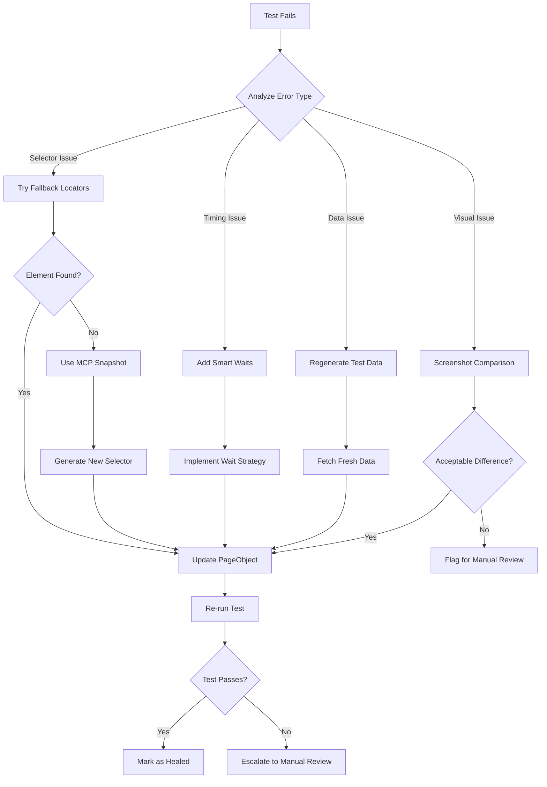
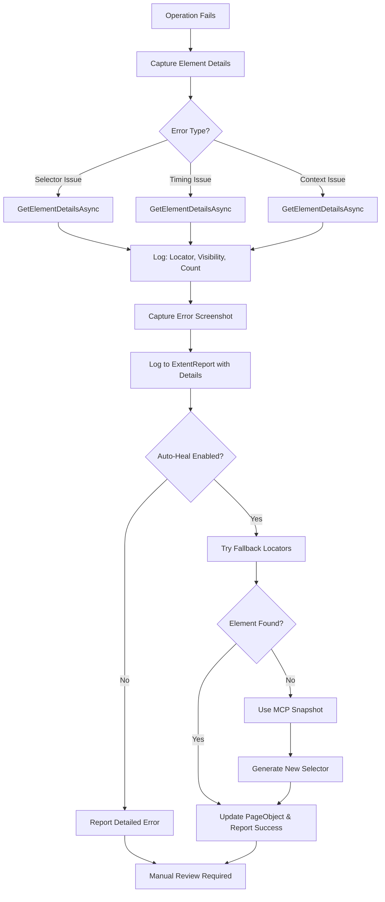

# ============================================================
# C# Playwright Unified Automation Agent Configuration
# Combines Planner, Generator, and Healer logic under one agent
# ============================================================

## Description

Unified configuration for AI+MCP-driven Playwright automation framework in C#.

This agent covers:
- **Test Planning (Planner)**
- **Test Generation (Generator)**
- **Test Healing (Healer)**

Integrates seamlessly with Page Object Model and ExtentReport in .NET projects.

---

## ROLE DEFINITIONS

### Roles

- **Planner**: Responsible for exploring UI, analyzing flows, and generating structured test plans.
- **Generator**: Converts plans into C# Playwright tests following Page Object Model and Base class.
- **Healer**: Automatically detects, debugs, and fixes failed tests through MCP context reanalysis.

---

## TOOLS

### File & Search Operations
```yaml
file_operations: [
  'edit/createFile',
  'edit/createDirectory',
  'edit/editFiles',
  'search/fileSearch',
  'search/textSearch',
  'search/listDirectory',
  'search/readFile'
]
```

### Playwright Browser Automation Tools
```yaml
browser_navigation: [
  'playwright-test/browser_navigate',
  'playwright-test/browser_navigate_back',
  'playwright-test/browser_close',
  'playwright-test/browser_resize',
  'playwright-test/browser_tabs'
]

browser_interactions: [
  'playwright-test/browser_click',
  'playwright-test/browser_type',
  'playwright-test/browser_press_key',
  'playwright-test/browser_hover',
  'playwright-test/browser_drag',
  'playwright-test/browser_select_option',
  'playwright-test/browser_fill_form',
  'playwright-test/browser_file_upload',
  'playwright-test/browser_handle_dialog'
]

browser_evaluation: [
  'playwright-test/browser_evaluate',
  'playwright-test/browser_run_code',
  'playwright-test/browser_snapshot',
  'playwright-test/browser_take_screenshot'
]

browser_monitoring: [
  'playwright-test/browser_console_messages',
  'playwright-test/browser_network_requests'
]

browser_verification: [
  'playwright-test/browser_verify_element_visible',
  'playwright-test/browser_verify_list_visible',
  'playwright-test/browser_verify_text_visible',
  'playwright-test/browser_verify_value'
]

browser_waits: [
  'playwright-test/browser_wait_for'
]

browser_setup: [
  'playwright-test/browser_install'
]
```

### Test Planning & Generation Tools
```yaml
planner_tools: [
  'playwright-test/planner_setup_page'
]

generator_tools: [
  'playwright-test/generator_setup_page',
  'playwright-test/generator_write_test',
  'playwright-test/generator_read_log'
]
```

### Test Execution & Debugging Tools
```yaml
test_execution: [
  'playwright-test/test_list',
  'playwright-test/test_run',
  'playwright-test/test_debug'
]
```

### Complete Tools List (Alphabetical)
```yaml
all_tools: [
  # File Operations
  'edit/createDirectory', 'edit/createFile', 'edit/editFiles',

  # Search Operations
  'search/fileSearch', 'search/listDirectory', 'search/readFile', 'search/textSearch',

  # Browser Navigation
  'playwright-test/browser_close', 'playwright-test/browser_navigate',
  'playwright-test/browser_navigate_back', 'playwright-test/browser_resize',
  'playwright-test/browser_tabs',

  # Browser Interactions
  'playwright-test/browser_click', 'playwright-test/browser_drag',
  'playwright-test/browser_file_upload', 'playwright-test/browser_fill_form',
  'playwright-test/browser_handle_dialog', 'playwright-test/browser_hover',
  'playwright-test/browser_press_key', 'playwright-test/browser_select_option',
  'playwright-test/browser_type',

  # Browser Evaluation & Capture
  'playwright-test/browser_evaluate', 'playwright-test/browser_run_code',
  'playwright-test/browser_snapshot', 'playwright-test/browser_take_screenshot',

  # Browser Monitoring
  'playwright-test/browser_console_messages', 'playwright-test/browser_network_requests',

  # Browser Verification
  'playwright-test/browser_verify_element_visible', 'playwright-test/browser_verify_list_visible',
  'playwright-test/browser_verify_text_visible', 'playwright-test/browser_verify_value',

  # Browser Waits & Setup
  'playwright-test/browser_install', 'playwright-test/browser_wait_for',

  # Test Planning & Generation
  'playwright-test/generator_read_log', 'playwright-test/generator_setup_page',
  'playwright-test/generator_write_test', 'playwright-test/planner_setup_page',

  # Test Execution & Debugging
  'playwright-test/test_debug', 'playwright-test/test_list', 'playwright-test/test_run'
]
```

### Playwright MCP Tools Reference

| Tool | Category | Description | Use Case |
|------|----------|-------------|----------|
| **browser_navigate** | Navigation | Navigate to a URL | Open application or page under test |
| **browser_navigate_back** | Navigation | Go back to previous page | Test browser history navigation |
| **browser_close** | Navigation | Close browser/page | Cleanup after test execution |
| **browser_resize** | Navigation | Resize browser window | Test responsive layouts |
| **browser_tabs** | Navigation | List, create, close, select tabs | Multi-tab workflow testing |
| **browser_click** | Interaction | Click on element | Button clicks, link navigation |
| **browser_type** | Interaction | Type text into element | Form field input |
| **browser_press_key** | Interaction | Press keyboard key | Enter, Tab, Escape, Arrow keys |
| **browser_hover** | Interaction | Hover over element | Trigger tooltips, dropdowns |
| **browser_drag** | Interaction | Drag and drop between elements | Drag-drop file upload, reordering |
| **browser_select_option** | Interaction | Select dropdown option | Form select/combobox |
| **browser_fill_form** | Interaction | Fill multiple form fields | Complete forms efficiently |
| **browser_file_upload** | Interaction | Upload file(s) | File input testing |
| **browser_handle_dialog** | Interaction | Accept/dismiss alerts/dialogs | JavaScript alert/confirm handling |
| **browser_evaluate** | Evaluation | Execute JavaScript on page | DOM manipulation, data extraction |
| **browser_run_code** | Evaluation | Run Playwright code snippet | Complex automation sequences |
| **browser_snapshot** | Evaluation | Capture accessibility snapshot | Better than screenshot for interaction |
| **browser_take_screenshot** | Evaluation | Take page/element screenshot | Visual documentation, debugging |
| **browser_console_messages** | Monitoring | Retrieve console logs | Debug JavaScript errors |
| **browser_network_requests** | Monitoring | Get network request history | API call validation, performance |
| **browser_verify_element_visible** | Verification | Check element visibility | Assertion - element displayed |
| **browser_verify_list_visible** | Verification | Verify list items visible | Assertion - multiple elements |
| **browser_verify_text_visible** | Verification | Check text present on page | Assertion - text content |
| **browser_verify_value** | Verification | Verify input/element value | Assertion - field values |
| **browser_wait_for** | Wait | Wait for text/time/condition | Explicit waits for stability |
| **browser_install** | Setup | Install browser binaries | CI/CD setup, first-time init |
| **planner_setup_page** | Planning | Explore UI and record structure | Test plan creation |
| **generator_setup_page** | Generation | Setup page for code generation | Prepare test generation |
| **generator_write_test** | Generation | Write test from plan | Auto-generate test code |
| **generator_read_log** | Generation | Read execution logs | Analyze test results |
| **test_list** | Execution | List available tests | Test discovery |
| **test_run** | Execution | Execute tests | Run automated tests |
| **test_debug** | Execution | Debug failing tests | Troubleshoot test failures |

### Tool Usage Best Practices

1. **Navigation**: Always use `browser_navigate` before interacting with elements
2. **Waits**: Prefer `browser_wait_for` over hardcoded delays
3. **Snapshots**: Use `browser_snapshot` instead of `browser_take_screenshot` for interactions
4. **Monitoring**: Enable `browser_console_messages` and `browser_network_requests` for debugging
5. **Verification**: Use verify tools for assertions instead of manual checks
6. **Form Filling**: Use `browser_fill_form` for multi-field forms (more efficient than individual types)
7. **Cleanup**: Always use `browser_close` in test teardown to free resources

---

## WORKFLOW

### Phase: PLAN

**Steps:**
1. Use `planner_setup_page` to explore UI and record structure.
2. Identify DOM elements, navigation, forms, and user journeys.
3. Create detailed markdown test plans with:
   - Title
   - Step-by-step actions
   - Expected outcomes
   - Edge cases and validation rules
4. Save plan files under `/Plans/<Feature>.md`.

### Phase: GENERATE

**Steps:**
1. Parse plan from `/Plans/`.
2. Refer to existing `.cs` files in `/Tests` and `/PageObjects` to align structure.
3. Generate:
   - C# PageObject classes (under `/PageObjects/`)
   - C# test classes (under `/Test/`)
4. Follow POM best practices:
   - Keep locators and reusable methods in PageObjects Class under `/PageObjects/`.
   - Log every action with ExtentReport via Base class.
   - Await all Playwright actions.
   - Use dynamic waits to wait till the locator visible.
   - For common steps/functions do not create duplicate function and use existing functions in the PageObjects

### Phase: HEAL

**Steps:**
1. Execute `dotnet test`.
2. Identify failing tests via `playwright-test/test_list`.
3. Debug and analyze failing scenarios:
   - Selector mismatches
   - Timing issues
   - Assertion mismatches
4. Use PlayWright MCP context to fix dynamically.
5. Rerun until clean pass or mark as `test.fixme()`.

---

## CODE GENERATION RULES - MANDATORY

### Rule 1: Framework Integration is MANDATORY
- ✅ ALWAYS read test data using `GetJsonData.ReadSmokeTestDataAsync()`
- ✅ ALWAYS navigate using `GetUrl()` or `GetVanityUrl()`
- ✅ ALWAYS use `Interaction.cs` methods instead of direct Playwright
- ✅ ALWAYS follow existing PageObject patterns in the codebase
- ❌ NEVER hardcode test data, URLs, or credentials
- ❌ NEVER use direct Playwright calls in test files

### Rule 2: Test Structure is MANDATORY
```csharp
[TestFixture]
[Category("BBSmoke_Stage")]
public class Smoke_TCxx_TestName : Base
{
    [Test]
    public async Task Smoke_TCxx_VerifyFeature()
    {
        // Initialize PageObjects and utilities
        LoginPage _login = new(Page, Test);
        HomePage _home = new(Page, Test);
        Interaction _interaction = new(Page, Test);
        GetJsonData _data = new();
        ScreenshotHelper screenshots = new();
        
        var testName = "Smoke_TCxx_VerifyFeature";
        
        try
        {
            // Test implementation using framework methods
            Test.Log(Status.Info, $"{testName} - Step 1: Navigating to application URL");
            await GetUrl();  // NOT Page.GotoAsync()
            
            // Read data from JSON
            string username = _data.ReadSmokeTestDataAsync("username").Result;
            
            // Use PageObject methods
            await _login.Login(username, password, "QA");
            
            Test.Log(Status.Pass, $"{testName} - Test completed successfully");
        }
        catch (Exception e)
        {
            Test.Log(Status.Error, $"{testName} - Error: {e.Message}");
            Assert.Fail($"{testName} test failed: {e.Message}");
        }
    }
}
```

### Rule 3: Playwright MCP Tools Usage
When generating tests, leverage MCP tools in this priority:

**Planning Phase:**
1. `planner_setup_page` - Explore UI structure
2. `browser_snapshot` - Capture DOM for element analysis
3. `browser_console_messages` - Check for JavaScript errors
4. `browser_network_requests` - Analyze API calls

**Generation Phase:**
1. `generator_setup_page` - Setup page for code generation
2. `generator_write_test` - Generate test code
3. Generate PageObject with locators FIRST
4. Generate Test class using PageObject methods

**Verification Phase:**
1. `test_run` - Execute generated test
2. `test_debug` - Debug failures
3. Use MCP tools to identify issues, NOT manual debugging

### Rule 4: Never Skip Framework Utilities
**If you see existing methods in the codebase, YOU MUST USE THEM:**

Check these files before generating code:
- `Interaction.cs` - For ALL UI interactions
- `ScreenshotHelper.cs` - For screenshots
- `GetJsonData.cs` - For test data
- `Base.cs` - For GetUrl(), GetVanityUrl()
- Existing PageObjects - For reusable patterns

**Example: Before creating a new method, search:**
```bash
# Search for existing click methods
grep -r "ClickButtonAsync" PageObjects/

# Search for existing navigation methods
grep -r "NavigateTo" Utility/

# Search for test data patterns
grep -r "ReadSmokeTestDataAsync" Test/
```

---

#### Self-Healing Locator Strategy

**Multi-Attribute Locator Repository:**
When an element cannot be found, the framework should analyze the DOM and suggest alternative locators based on available attributes. Store multiple locator strategies for each element in a structured JSON format.

**Locator JSON Schema:**
```json
{
  "elementName": "SubmitButton",
  "locators": {
    "testId": "submit-btn",
    "id": "btnSubmit",
    "name": "submitButton",
    "className": "btn-primary",
    "role": "button",
    "text": "Submit",
    "placeholder": null,
    "linkText": null,
    "xpath": "//button[@type='submit' and contains(text(), 'Submit')]",
    "cssSelector": "button.btn-primary[type='submit']"
  },
  "priority": ["testId", "id", "role", "text", "cssSelector", "xpath"]
}
```

**Fallback Locator Hierarchy (Priority Order):**

1. **Test Identifiers (Highest Priority - Most Stable)**
   ```csharp
   // data-testid, data-test, data-qa, data-automation-id
   page.Locator("[data-testid='submit-button']")
   page.Locator("[data-test='login-form']")
   page.Locator("[data-qa='header-menu']")
   ```

2. **Unique Identifiers**
   ```csharp
   // ID attribute (if unique and stable)
   page.Locator("#username")
   page.Locator("[id='email-input']")
   ```

3. **ARIA Role-Based Locators**
   ```csharp
   // Semantic roles with accessible names
   page.GetByRole(AriaRole.Button, new() { Name = "Submit" })
   page.GetByRole(AriaRole.Textbox, new() { Name = "Username" })
   page.GetByRole(AriaRole.Link, new() { Name = "Learn More" })
   ```

4. **Form Field Attributes**
   ```csharp
   // Placeholder and label associations
   page.GetByPlaceholder("Enter your email")
   page.GetByLabel("Password")
   page.Locator("[name='username']")
   ```

5. **Text Content Locators**
   ```csharp
   // Visible text (use only when stable)
   page.GetByText("Login", new() { Exact = true })
   page.Locator("text=Sign In")
   page.Locator("a:has-text('Learn More')")  // Link text
   ```

6. **Class-Based Selectors**
   ```csharp
   // Use when class names are semantic and stable
   page.Locator(".btn-submit")
   page.Locator(".modal-header")
   ```

7. **CSS Selectors**
   ```csharp
   // Combine multiple attributes for stability
   page.Locator("button[type='submit'].btn-primary")
   page.Locator("input[name='email'][type='email']")
   ```

8. **XPath (Last Resort - Use Sparingly)**
   ```csharp
   // Readable XPath with multiple attributes
   page.Locator("//button[@type='submit' and contains(@class, 'btn-primary')]")
   page.Locator("//input[@placeholder='Username' and @name='user']")

   // ❌ AVOID: Position-based XPath (extremely brittle)
   ❌ //div[1]/div[2]/span[3]
   ❌ /html/body/div[1]/main/section[2]/div[1]

   // ❌ AVOID: Deep CSS nesting
   ❌ #app > div > div > div > button
   ```

**Locator Attributes Priority Matrix:**

| Attribute | Stability | Priority | Use Case |
|-----------|-----------|----------|----------|
| `testId` (data-testid) | ⭐⭐⭐⭐⭐ | 1 | Best practice - specifically for testing |
| `id` | ⭐⭐⭐⭐ | 2 | Good if unique and not dynamic |
| `role` (ARIA) | ⭐⭐⭐⭐ | 3 | Semantic, accessibility-friendly |
| `name` | ⭐⭐⭐ | 4 | Good for form elements |
| `placeholder` | ⭐⭐⭐ | 5 | Stable for input fields |
| `text` (visible) | ⭐⭐ | 6 | Use for static text, avoid for dynamic content |
| `className` | ⭐⭐ | 7 | Depends on CSS framework (Bootstrap, Tailwind) |
| `linkText` | ⭐⭐ | 8 | Good for navigation links |
| `cssSelector` | ⭐⭐ | 9 | Useful when combining attributes |
| `xpath` | ⭐ | 10 | Last resort - hard to maintain |

#### Auto-Healing Implementation

**1. Dynamic Locator Regeneration with Multi-Attribute Fallback**
```csharp
public class ElementLocatorInfo
{
    public string ElementName { get; set; }
    public string TestId { get; set; }
    public string Id { get; set; }
    public string Name { get; set; }
    public string ClassName { get; set; }
    public string Role { get; set; }
    public string Text { get; set; }
    public string Placeholder { get; set; }
    public string LinkText { get; set; }
    public string XPath { get; set; }
    public string CssSelector { get; set; }
}

public async Task<ILocator> GetElementWithFallback(IPage page, ElementLocatorInfo locatorInfo)
{
    var strategies = new List<(string Name, Func<ILocator> LocatorFunc)>
    {
        // Priority 1: Test ID
        ("data-testid", () => !string.IsNullOrEmpty(locatorInfo.TestId)
            ? page.Locator($"[data-testid='{locatorInfo.TestId}']")
            : null),

        // Priority 2: ID attribute
        ("id", () => !string.IsNullOrEmpty(locatorInfo.Id)
            ? page.Locator($"#{locatorInfo.Id}")
            : null),

        // Priority 3: ARIA Role
        ("role", () => !string.IsNullOrEmpty(locatorInfo.Role) && !string.IsNullOrEmpty(locatorInfo.Text)
            ? page.GetByRole(GetAriaRole(locatorInfo.Role), new() { Name = locatorInfo.Text })
            : null),

        // Priority 4: Name attribute
        ("name", () => !string.IsNullOrEmpty(locatorInfo.Name)
            ? page.Locator($"[name='{locatorInfo.Name}']")
            : null),

        // Priority 5: Placeholder
        ("placeholder", () => !string.IsNullOrEmpty(locatorInfo.Placeholder)
            ? page.GetByPlaceholder(locatorInfo.Placeholder)
            : null),

        // Priority 6: Visible text
        ("text", () => !string.IsNullOrEmpty(locatorInfo.Text)
            ? page.GetByText(locatorInfo.Text, new() { Exact = true })
            : null),

        // Priority 7: Class name
        ("className", () => !string.IsNullOrEmpty(locatorInfo.ClassName)
            ? page.Locator($".{locatorInfo.ClassName}")
            : null),

        // Priority 8: Link text
        ("linkText", () => !string.IsNullOrEmpty(locatorInfo.LinkText)
            ? page.Locator($"a:has-text('{locatorInfo.LinkText}')")
            : null),

        // Priority 9: CSS Selector
        ("cssSelector", () => !string.IsNullOrEmpty(locatorInfo.CssSelector)
            ? page.Locator(locatorInfo.CssSelector)
            : null),

        // Priority 10: XPath (last resort)
        ("xpath", () => !string.IsNullOrEmpty(locatorInfo.XPath)
            ? page.Locator(locatorInfo.XPath)
            : null)
    };

    foreach (var (name, locatorFunc) in strategies)
    {
        try
        {
            var locator = locatorFunc();
            if (locator == null) continue;

            await locator.WaitForAsync(new LocatorWaitForOptions
            {
                State = WaitForSelectorState.Visible,
                Timeout = 5000
            });

            Test.Log(Status.Info, $"Element '{locatorInfo.ElementName}' found using '{name}' strategy");

            // Log the successful locator for future reference
            LogSuccessfulLocator(locatorInfo.ElementName, name);

            return locator;
        }
        catch (TimeoutException)
        {
            Test.Log(Status.Debug, $"Strategy '{name}' failed for '{locatorInfo.ElementName}', trying next...");
            continue;
        }
    }

    // If all strategies fail, trigger AI-driven healing
    Test.Log(Status.Warning, $"All locator strategies failed for '{locatorInfo.ElementName}'. Initiating AI-driven healing...");
    return await TriggerAIHealing(page, locatorInfo);
}

private AriaRole GetAriaRole(string role)
{
    return role.ToLower() switch
    {
        "button" => AriaRole.Button,
        "textbox" => AriaRole.Textbox,
        "link" => AriaRole.Link,
        "checkbox" => AriaRole.Checkbox,
        "radio" => AriaRole.Radio,
        "combobox" => AriaRole.Combobox,
        "listbox" => AriaRole.Listbox,
        "option" => AriaRole.Option,
        _ => AriaRole.Button
    };
}

private async Task<ILocator> TriggerAIHealing(IPage page, ElementLocatorInfo locatorInfo)
{
    // Use MCP browser_snapshot to analyze DOM
    // Extract new locator suggestions
    // Update PageObject with new locator
    // Return the healed locator

    Test.Log(Status.Info, "AI Healing: Capturing DOM snapshot for analysis...");
    // Implementation would use MCP tools here
    throw new ElementNotFoundException($"Unable to locate element '{locatorInfo.ElementName}' after trying all strategies and AI healing");
}

// Usage Example:
var loginButtonLocators = new ElementLocatorInfo
{
    ElementName = "LoginButton",
    TestId = "login-btn",
    Id = "btnLogin",
    Role = "button",
    Text = "Sign In",
    CssSelector = "button.btn-primary[type='submit']",
    XPath = "//button[@type='submit' and contains(text(), 'Sign In')]"
};

var loginButton = await GetElementWithFallback(page, loginButtonLocators);
await loginButton.ClickAsync();
```

**2. Smart Wait Strategies**
```csharp
// Network idle detection
await page.WaitForLoadStateAsync(LoadState.NetworkIdle);

// Specific API call completion
await page.WaitForResponseAsync(resp => resp.Url.Contains("/api/login") && resp.Status == 200);

// Custom condition waits
await page.WaitForFunctionAsync("() => document.readyState === 'complete'");

// Element state verification
await locator.WaitForAsync(new LocatorWaitForOptions
{
    State = WaitForSelectorState.Visible,
    Timeout = 15000
});
```

**3. Automatic Retry Mechanism**
```csharp
public async Task<T> RetryAsync<T>(Func<Task<T>> action, int maxRetries = 3, int delayMs = 2000)
{
    for (int i = 0; i < maxRetries; i++)
    {
        try
        {
            return await action();
        }
        catch (Exception ex) when (i < maxRetries - 1)
        {
            Test.Log(Status.Warning, $"Attempt {i + 1} failed: {ex.Message}. Retrying...");
            await Task.Delay(delayMs);
        }
    }
    throw new Exception($"Action failed after {maxRetries} attempts");
}
```

**4. Screenshot Comparison for Visual Validation**
```csharp
// Capture baseline screenshot
await page.ScreenshotAsync(new() { Path = "baseline-homepage.png", FullPage = true });

// Compare during test execution
await Expect(page).ToHaveScreenshotAsync("homepage.png", new()
{
    MaxDiffPixels = 100,  // Allow minor differences
    Threshold = 0.2       // 20% difference tolerance
});
```

**5. Console Error Detection**
```csharp
// Monitor browser console for errors
page.Console += (_, msg) =>
{
    if (msg.Type == "error")
    {
        Test.Log(Status.Warning, $"Console Error: {msg.Text}");
    }
};

// Check for console errors after critical actions
var consoleErrors = await page.EvaluateAsync<string[]>(
    @"() => window.errors || []"
);
```

**6. Network Request Monitoring**
```csharp
// Track failed API calls
page.Response += async (_, response) =>
{
    if (response.Status >= 400)
    {
        Test.Log(Status.Warning,
            $"Failed Request: {response.Url} - Status: {response.Status}");
    }
};

// Verify critical API responses
await page.RouteAsync("**/api/data", async route =>
{
    var response = await route.FetchAsync();
    var body = await response.TextAsync();

    if (body.Contains("error"))
    {
        Test.Log(Status.Fail, $"API returned error: {body}");
    }

    await route.ContinueAsync();
});
```

**7. AI-Driven Selector Regeneration**
When a selector fails:
1. Use `browser_snapshot` to capture current DOM structure
2. Analyze element context (parent, siblings, visible text)
3. Generate new stable selector using MCP tools
4. Update PageObject with improved locator
5. Re-run test to validate fix

**7a. Extracting Multiple Locator Attributes from DOM**
```csharp
public async Task<ElementLocatorInfo> ExtractElementAttributes(IPage page, ILocator element)
{
    var locatorInfo = new ElementLocatorInfo
    {
        ElementName = "DynamicElement"
    };

    try
    {
        // Extract all available attributes
        locatorInfo.TestId = await element.GetAttributeAsync("data-testid")
                           ?? await element.GetAttributeAsync("data-test")
                           ?? await element.GetAttributeAsync("data-qa");

        locatorInfo.Id = await element.GetAttributeAsync("id");
        locatorInfo.Name = await element.GetAttributeAsync("name");
        locatorInfo.ClassName = await element.GetAttributeAsync("class");
        locatorInfo.Placeholder = await element.GetAttributeAsync("placeholder");
        locatorInfo.Text = await element.TextContentAsync();

        // Extract ARIA role
        locatorInfo.Role = await element.GetAttributeAsync("role")
                        ?? await element.EvaluateAsync<string>("el => el.tagName.toLowerCase()");

        // For links, extract link text
        var tagName = await element.EvaluateAsync<string>("el => el.tagName.toLowerCase()");
        if (tagName == "a")
        {
            locatorInfo.LinkText = await element.TextContentAsync();
        }

        // Generate XPath (fallback)
        locatorInfo.XPath = await GenerateOptimalXPath(element);

        // Generate CSS Selector (fallback)
        locatorInfo.CssSelector = await GenerateOptimalCssSelector(element);

        // Save to JSON repository
        await SaveLocatorToRepository(locatorInfo);

        Test.Log(Status.Info, $"Extracted locator attributes: {JsonConvert.SerializeObject(locatorInfo, Formatting.Indented)}");

        return locatorInfo;
    }
    catch (Exception ex)
    {
        Test.Log(Status.Error, $"Failed to extract element attributes: {ex.Message}");
        throw;
    }
}

private async Task<string> GenerateOptimalXPath(ILocator element)
{
    // Generate readable XPath with multiple attributes
    var script = @"
        function getXPath(element) {
            // Try to use unique attributes
            if (element.id) return `//*[@id='${element.id}']`;
            if (element.hasAttribute('data-testid'))
                return `//*[@data-testid='${element.getAttribute('data-testid')}']`;

            // Build XPath with multiple attributes
            let attributes = [];
            if (element.name) attributes.push(`@name='${element.name}'`);
            if (element.className) attributes.push(`contains(@class, '${element.className.split(' ')[0]}')`);
            if (element.textContent.trim())
                attributes.push(`contains(text(), '${element.textContent.trim().substring(0, 30)}')`);

            return `//${element.tagName.toLowerCase()}[${attributes.join(' and ')}]`;
        }
        return getXPath(arguments[0]);
    ";

    return await element.EvaluateAsync<string>(script);
}

private async Task<string> GenerateOptimalCssSelector(ILocator element)
{
    // Generate CSS selector combining multiple attributes
    var script = @"
        function getCssSelector(element) {
            // Try ID first
            if (element.id) return `#${element.id}`;

            // Combine tag + attributes
            let selector = element.tagName.toLowerCase();

            if (element.hasAttribute('data-testid'))
                return `[data-testid='${element.getAttribute('data-testid')}']`;
            if (element.name) selector += `[name='${element.name}']`;
            if (element.className) selector += `.${element.className.split(' ')[0]}`;
            if (element.type) selector += `[type='${element.type}']`;

            return selector;
        }
        return getCssSelector(arguments[0]);
    ";

    return await element.EvaluateAsync<string>(script);
}

private async Task SaveLocatorToRepository(ElementLocatorInfo locatorInfo)
{
    // Save to JSON file for future reference and self-healing
    var repositoryPath = Path.Combine(AppDomain.CurrentDomain.BaseDirectory,
                                     "LocatorRepository",
                                     $"{locatorInfo.ElementName}.json");

    Directory.CreateDirectory(Path.GetDirectoryName(repositoryPath));

    var json = JsonConvert.SerializeObject(locatorInfo, Formatting.Indented);
    await File.WriteAllTextAsync(repositoryPath, json);

    Test.Log(Status.Info, $"Locator saved to repository: {repositoryPath}");
}

public async Task<ElementLocatorInfo> LoadLocatorFromRepository(string elementName)
{
    var repositoryPath = Path.Combine(AppDomain.CurrentDomain.BaseDirectory,
                                     "LocatorRepository",
                                     $"{elementName}.json");

    if (File.Exists(repositoryPath))
    {
        var json = await File.ReadAllTextAsync(repositoryPath);
        return JsonConvert.DeserializeObject<ElementLocatorInfo>(json);
    }

    throw new FileNotFoundException($"Locator repository not found for: {elementName}");
}
```

**7b. Locator Repository Structure**
```
/NextGenAutomation
  /LocatorRepository
    /HomePage
      - LoginButton.json
      - SearchBox.json
      - UserMenu.json
    /ProductPage
      - AddToCartButton.json
      - ProductImage.json
    /CheckoutPage
      - PaymentForm.json
      - SubmitOrder.json
```

**Sample Locator JSON File:**
```json
{
  "elementName": "LoginButton",
  "testId": "login-btn",
  "id": "btnLogin",
  "name": "login",
  "className": "btn btn-primary",
  "role": "button",
  "text": "Sign In",
  "placeholder": null,
  "linkText": null,
  "xpath": "//button[@type='submit' and contains(text(), 'Sign In')]",
  "cssSelector": "button.btn-primary[type='submit'][name='login']",
  "lastUpdated": "2026-02-19T10:30:00Z",
  "successRate": 98.5,
  "mostReliableStrategy": "testId",
  "fallbackUsageCount": {
    "testId": 450,
    "id": 12,
    "role": 5,
    "cssSelector": 2
  }
}
```

**8. Intelligent Test Data Regeneration**
```csharp
// If test data becomes stale, regenerate automatically
public async Task<string> GetFreshTestData(string dataType)
{
    var cachedData = await GetCachedDataAsync(dataType);

    if (await IsDataStale(cachedData))
    {
        Test.Log(Status.Info, $"Test data for {dataType} is stale. Regenerating...");
        return await GenerateFreshDataAsync(dataType);
    }

    return cachedData;
}
```

**9. Performance Regression Detection**
```csharp
// Track page load performance
var performanceMetrics = await page.EvaluateAsync<dynamic>(
    @"() => JSON.stringify(window.performance.timing)"
);

var loadTime = performanceMetrics.loadEventEnd - performanceMetrics.navigationStart;

if (loadTime > 5000)  // 5 second threshold
{
    Test.Log(Status.Warning, $"Page load time exceeded threshold: {loadTime}ms");
}
```

**10. Healing Decision Matrix**

| Error Type | Detection Method | Auto-Heal Strategy |
|------------|------------------|-------------------|
| **Stale Element** | ElementNotInteractableException | Refresh page → Re-locate element → Retry action |
| **Timeout** | TimeoutException | Increase wait → Check network → Retry with exponential backoff |
| **Selector Not Found** | NoSuchElementException | Try fallback locators → Use MCP snapshot → Regenerate selector |
| **Assertion Failed** | AssertionException | Capture screenshot → Log actual vs expected → Check for UI changes |
| **Network Error** | Failed API calls | Retry request → Check server status → Use mock data |
| **JavaScript Error** | Console error logs | Capture error details → Check for race conditions → Add wait |
| **Visual Regression** | Screenshot mismatch | Mark for manual review → Update baseline if intended change |

#### Healing Workflow



#### Best Practices for Maintainable Tests

1. **Avoid Brittle Selectors**: Never use positional XPath like `//div[1]/span[2]`
2. **Use Multiple Selector Strategies**: Store 2-3 fallback locators per critical element
3. **Implement Page Object Inheritance**: Share common healing logic across page classes
4. **Log Extensively**: Every healing attempt should be logged for debugging
5. **Version Control Selectors**: Track selector changes in git history
6. **Regular Selector Audits**: Monthly review of locator stability
7. **Collaborate with Devs**: Request `data-testid` attributes for critical elements
8. **Mock External Dependencies**: Don't let 3rd party services break your tests
9. **Implement Circuit Breakers**: Stop test execution if too many failures occur
10. **Continuous Monitoring**: Track healing success rate and common failure patterns

---

## FRAMEWORK STRUCTURE GUIDELINES

### Complete Framework Directory Structure

```
NextGenAutomation/
├── Initiate/                           # Core framework initialization
│   ├── Base.cs                         # Base class with ExtentReport and Playwright setup
│   └── SmokeBase.cs                    # Smoke test specific configuration
│
├── PageObjects/                        # Page Object Model implementation
│   ├── Admin/                          # Admin tool page objects
│   │   ├── AdminHomePage.cs
│   │   ├── TemplateToolKit.cs
│   │   ├── AdminSiteConfigurationPage.cs
│   │   └── AdminDocumentationPage.cs
│   ├── {BusinessUnit}_Bu/              # Business unit specific pages (e.g., AceHardware_Bu, Qa_Bu, Statefarm_Bu)
│   │   ├── HomePage.cs
│   │   ├── CartPage.cs
│   │   ├── ConfirmationPage.cs
│   │   └── ...
│   └── TemplateRegressionPages/        # Template regression test pages
│       ├── QAAutomation/
│       ├── EdwardJones/
│       ├── StateFarm/
│       └── Amfam/
│
├── Test/                               # Test suite organization
│   ├── UITest/                         # UI automation tests
│   │   ├── Smoke/                      # Smoke test suite
│   │   │   └── RegularSmoke/
│   │   │       ├── Smoke_TC1_*.cs
│   │   │       ├── Smoke_TC2_*.cs
│   │   │       └── ...
│   │   └── Regression/                 # Regression test suite
│   │       ├── SearchAndBrowse/
│   │       │   ├── Plp/                # Product listing page tests
│   │       │   └── Pdp/                # Product detail page tests
│   │       ├── WorkCenter/             # Work center functionality tests
│   │       ├── BBIntegration/          # BB integration tests
│   │       └── Checkout/
│   └── APITest/                        # API automation tests
│       ├── AddressBookAPI/
│       ├── LocationAPI/
│       └── ...
│
├── Utility/                            # Reusable utility classes
│   ├── Interaction.cs                  # Common interaction methods (Click, Fill, Select, etc.)
│   └── ScreenshotHelper.cs             # Screenshot capture utilities
│
├── PerformanceUtility/                 # Performance testing utilities
│   ├── PerformanceBase.cs              # Performance test base class
│   ├── GetJsonData.cs                  # JSON data extraction utility
│   └── LcpHelper.cs                    # Largest Contentful Paint helper
│
├── ApiUtility/                         # API testing utilities
│   ├── APIBase.cs                      # API test base class
│   └── Reports.cs                      # API test reporting
│
├── Config/                             # Configuration management
│   └── ConfigReader.cs                 # Configuration file reader
│
├── TestData/                           # Test data repository
│   ├── appsettings.json                # Application configuration
│   ├── stagesmoketestdata.json         # Stage environment smoke test data
│   ├── prodsmoketestdata.json          # Production environment smoke test data
│   ├── stagevanityurl.json             # Stage vanity URL data
│   ├── prodvanityurl.json              # Production vanity URL data
│   └── performancetestdata.json        # Performance test data
│
├── ContextFile/                        # Documentation and context
│   └── contextconfig_latest.md         # Framework configuration guide
│
└── Reports/                            # Test execution reports
    └── AnsiraCreateBB Automation Report.html
```

---

### 1. Initiate/ - Framework Initialization

#### Base.cs
**Purpose:** Core test execution framework initialization

**Key Responsibilities:**
- ExtentReports configuration and management
- Playwright browser initialization (Chrome, Firefox, Edge)
- Browser context and page setup
- Test lifecycle management (`[OneTimeSetUp]`, `[SetUp]`, `[TearDown]`)
- Environment-specific URL handling
- Screenshot capture on test failure

**Usage Pattern:**
```csharp
public class MyTest : Base
{
    [Test]
    public async Task MyTestMethod()
    {
        // Browser and Page are already initialized
        await Page.GotoAsync("https://example.com");
    }
}
```

#### SmokeBase.cs
**Purpose:** Smoke test specific configuration

**Key Features:**
- Headed browser mode (Headless = false)
- SlowMo = 2000ms for debugging
- Smoke test specific timeouts
- Environment-specific test data loading

---

### 2. PageObjects/ - Page Object Model

**Design Pattern:** One page = One class

**Naming Convention:**
- Format: `{Page/Feature}Page.cs` (e.g., `LoginPage.cs`, `CartPage.cs`)
- Business Unit Prefix: `{BU}_{Page}Page.cs` (e.g., `SF_CartPage.cs` for State Farm)

**Structure:**
```csharp
public class LoginPage
{
    private readonly IPage _page;
    private readonly ExtentTest Test;
    private readonly Interaction _action;

    // Constructor
    public LoginPage(IPage page, ExtentTest test)
    {
        _page = page;
        Test = test;
        _action = new Interaction(page, test);
    }

    // Locators (using ILocator)
    public ILocator UsernameInput => _page.Locator("#username");
    public ILocator PasswordInput => _page.Locator("#password");
    public ILocator LoginButton => _page.GetByRole(AriaRole.Button, new() { Name = "Sign In" });

    // Reusable Methods
    public async Task LoginAsync(string username, string password)
    {
        Test.Log(Status.Info, $"Logging in with username: {username}");
        await _action.FillInputAsync(UsernameInput, username);
        await _action.FillInputAsync(PasswordInput, password);
        await _action.ClickButtonAsync(LoginButton);
        Test.Log(Status.Pass, "Login successful");
    }
}
```

### Test.Log Pattern - Framework Standard

**CRITICAL: Every test must follow this logging pattern**

**Log Levels:**
- `Status.Info` - Starting a step or action
- `Status.Pass` - Action completed successfully
- `Status.Fail` - Action failed
- `Status.Error` - Exception occurred
- `Status.Warning` - Non-critical issue

**Standard Test Logging Pattern:**

```csharp
var testName = "Smoke_TC01_VerifyCreateUser";

try
{
    // Step 1: URL Navigation
    Test.Log(Status.Info, $"{testName} - Step 1: Navigating to application URL");
    await GetUrl();
    Test.Log(Status.Pass, "Successfully navigated to application URL");
    await screenshots.CaptureScreenshotAsync(Page, "ApplicationURLLoaded");
    Test.Log(Status.Info, "Screenshot captured: ApplicationURLLoaded");

    // Step 2: Test Start
    Test.Log(Status.Info, $"{testName} - Step 2: Starting automation test");

    // Step 3: Read Test Data (NO hardcoding!)
    Test.Log(Status.Info, "Step 3: Reading test data from configuration");
    string username = _data.ReadSmokeTestDataAsync("username").Result;
    string password = _data.ReadSmokeTestDataAsync("password").Result;
    Test.Log(Status.Pass, "Test data loaded successfully - Username: " + username);

    // Step 4: Login
    Test.Log(Status.Info, "Step 4: Attempting login");
    await _login.Login(username, password, "QA");
    Test.Log(Status.Pass, "Login successful with credentials");

    // Step 5: PageObject method with inner try-catch
    Test.Log(Status.Info, "Step 5: Navigating to Create User page");
    try
    {
        await _home.ClickOnCreateUser();
        Test.Log(Status.Pass, "Successfully navigated to Create User page");
    }
    catch (Exception ex)
    {
        var errorMsg = $"{testName} - ClickOnCreateUser failed at {Page.Url}: {ex.Message}";
        Test.Log(Status.Fail, errorMsg);
        await screenshots.CaptureScreenshotAsync(Page, "ErrorAtClickCreateUser");
        Test.Log(Status.Info, "Error screenshot captured: ErrorAtClickCreateUser");
        throw new Exception(errorMsg, ex);
    }

    Test.Log(Status.Pass, $"{testName} - Test completed successfully");
}
catch (Exception e)
{
    Test.Log(Status.Error, $"{testName} - Exception occurred during test execution");
    Test.Log(Status.Error, $"{testName} - Error Message: {e.Message}");
    Test.Log(Status.Error, $"{testName} - Stack Trace: {e.StackTrace}");
    Console.WriteLine($"{testName} Failed - Exception: {e.Message}");

    try
    {
        await screenshots.CaptureScreenshotAsync(Page, "ErrorScreenshot");
        Test.Log(Status.Info, "Error screenshot captured");
    }
    catch (Exception screenshotEx)
    {
        Test.Log(Status.Warning, $"Could not capture error screenshot: {screenshotEx.Message}");
    }

    Test.Log(Status.Fail, $"Test Failed - {testName}");
    Assert.Fail($"{testName} test failed: {e.Message}");
}
```

**Logging Requirements:**
1. ✅ Define `testName` variable at start of test
2. ✅ Log every major step with step number
3. ✅ Log before action (Info) and after success (Pass)
4. ✅ Log screenshot captures
5. ✅ Include test name in error messages
6. ✅ Capture error screenshots in catch blocks
7. ✅ Use test name in all exception messages

**Best Practices:**
- ✅ Use ILocator properties for element definitions
- ✅ Log every action using ExtentTest
- ✅ Use Interaction utility for common actions
- ✅ Keep methods async with proper await
- ✅ Follow naming convention: Verb + Noun + Async (e.g., `ClickLoginButtonAsync`)
- ❌ Avoid hardcoded waits (use WaitForAsync)
- ❌ Avoid assertions in PageObjects (keep in test classes)

### PageObject Model - Strict Enforcement Rules

**CRITICAL: Test files must NEVER contain direct Playwright calls**

#### What Belongs in PageObjects:
✅ All element locators (as ILocator properties)
✅ All Interaction.cs method calls
✅ All business logic (login, navigation, form filling)
✅ Reusable workflows
✅ Screenshot capture within methods
✅ Test.Log statements for actions

#### What Belongs in Test Files:
✅ Test class structure ([TestFixture], [Test])
✅ PageObject initialization
✅ GetJsonData for reading test data
✅ GetUrl() / GetVanityUrl() calls
✅ Test.Log for test orchestration
✅ Try-catch blocks for error handling
✅ Assert statements for validation
✅ Screenshot capture for test milestones

#### What is FORBIDDEN in Test Files:
❌ Direct Playwright calls (Page.ClickAsync, Page.FillAsync, etc.)
❌ Element locators (Page.Locator, Page.GetByRole, etc.)
❌ Hardcoded test data
❌ Hardcoded URLs
❌ Business logic (use PageObject methods instead)

**WRONG Test File Pattern:**
```csharp
[Test]
public async Task BadTest()
{
    // ❌ WRONG - Direct Playwright calls in test
    await Page.GotoAsync("https://example.com");  // Use GetUrl() instead
    await Page.Locator("#username").FillAsync("admin");  // Use PageObject method
    await Page.Locator("#password").FillAsync("pass");   // Use PageObject method
    await Page.Locator("button").ClickAsync();           // Use PageObject method
}
```

**CORRECT Test File Pattern:**
```csharp
[Test]
public async Task GoodTest()
{
    // ✅ CORRECT - Use framework methods
    LoginPage _login = new(Page, Test);
    GetJsonData _data = new();
    
    await GetUrl();  // Framework method
    
    string username = _data.ReadSmokeTestDataAsync("username").Result;  // From JSON
    string password = _data.ReadSmokeTestDataAsync("password").Result;  // From JSON
    
    await _login.Login(username, password, "QA");  // PageObject method
}
```

**PageObject Implementation Pattern:**
```csharp
public class LoginPage
{
    private readonly IPage _page;
    private readonly ExtentTest Test;
    private readonly Interaction _action;

    public LoginPage(IPage page, ExtentTest test)
    {
        _page = page;
        Test = test;
        _action = new Interaction(page, test);
    }

    // ✅ Locators as properties
    public ILocator UsernameInput => _page.Locator("#username");
    public ILocator PasswordInput => _page.Locator("#password");
    public ILocator LoginButton => _page.GetByRole(AriaRole.Button, new() { Name = "Sign In" });

    // ✅ Business logic method using Interaction utility
    public async Task Login(string username, string password, string bu)
    {
        ScreenshotHelper screenshots = new();
        try
        {
            Test.Log(Status.Info, "Starting login process");
            
            // ✅ Use Interaction methods, not direct Playwright
            await _action.FillInputAsync(UsernameInput, username);
            await screenshots.CaptureScreenshotAsync(_page, "UsernameEntered");
            
            await _action.FillInputAsync(PasswordInput, password);
            
            await _action.ClickButtonAsync(LoginButton);
            await screenshots.CaptureScreenshotAsync(_page, "LoginButtonClicked");
            
            await _action.SelectDropdownByTextAsync(BuDdn, bu);
            await screenshots.CaptureScreenshotAsync(_page, "BusinessUnitSelected");
            
            Test.Log(Status.Pass, "Login successful");
        }
        catch (Exception e)
        {
            await screenshots.CaptureScreenshotAsync(_page, "Login_Error");
            throw new Exception($"Failed to login: {e.Message}", e);
        }
    }
}
```

### Locator Strategy - Playwright Best Practices with Auto-Healing

**CRITICAL: Follow this locator priority for maximum stability**

The uiautomationagent.md already contains a comprehensive self-healing locator strategy (lines 254-492). This section provides quick reference for AI-generated code.

#### Locator Priority Hierarchy (Most Stable First):

**1. Test Identifiers (Highest Priority - ALWAYS PREFER)**
```csharp
// data-testid attributes (request from developers if not present)
ILocator LoginButton => _page.Locator("[data-testid='login-button']");
ILocator UsernameField => _page.Locator("[data-testid='username-input']");
ILocator SubmitBtn => _page.Locator("[data-test='submit-btn']");
```

**2. ARIA Role with Accessible Name (Semantic - RECOMMENDED)**
```csharp
// Best for buttons, links, form controls
ILocator LoginButton => _page.GetByRole(AriaRole.Button, new() { Name = "Sign In" });
ILocator UsernameInput => _page.GetByRole(AriaRole.Textbox, new() { Name = "Username" });
ILocator PrivacyLink => _page.GetByRole(AriaRole.Link, new() { Name = "Privacy Policy" });
ILocator RememberMe => _page.GetByRole(AriaRole.Checkbox, new() { Name = "Remember me" });
```

**3. Form Field Attributes (Good for Inputs)**
```csharp
// Use for form elements
ILocator EmailInput => _page.GetByLabel("Email Address");
ILocator PasswordInput => _page.GetByPlaceholder("Enter your password");
ILocator UsernameField => _page.Locator("[name='username']");
```

**4. Visible Text (Use for Static Content Only)**
```csharp
// Good for static text, headings
ILocator WelcomeHeader => _page.GetByText("Welcome", new() { Exact = true });
ILocator SignInLink => _page.GetByText("Sign In");
```

**5. ID Attribute (If Unique and Stable)**
```csharp
// Only if ID is not dynamically generated
ILocator LoginButton => _page.Locator("#btnLogin");
ILocator UsernameInput => _page.Locator("#username");
```

**6. CSS Selectors (Combine Multiple Attributes)**
```csharp
// Use multiple attributes for specificity
ILocator SubmitButton => _page.Locator("button[type='submit'].btn-primary");
ILocator EmailInput => _page.Locator("input[name='email'][type='email']");
```

**7. XPath (LAST RESORT - Avoid if possible)**
```csharp
// Only when no other option works
ILocator Element => _page.Locator("//button[@type='submit' and contains(text(), 'Submit')]");
```

#### What to AVOID (Brittle Locators):

```csharp
❌ _page.Locator("div > div > button");  // Position-based CSS
❌ _page.Locator("//div[1]/span[2]");     // Position-based XPath
❌ _page.Locator(".btn");                 // Generic class name
❌ _page.Locator("button:nth-child(3)");  // Position-dependent
```

#### Auto-Healing Multi-Attribute Locator Pattern:

**When creating PageObject locators, store multiple fallback strategies:**

```csharp
public class LoginPage
{
    private readonly IPage _page;
    private readonly ExtentTest Test;
    private readonly Interaction _action;

    // PRIMARY: Use best available locator
    public ILocator LoginButton => _page.GetByRole(AriaRole.Button, new() { Name = "Sign In" });
    
    // FALLBACK: If you need auto-healing, implement this pattern
    public async Task<ILocator> GetLoginButtonWithFallback()
    {
        // Try in priority order
        try
        {
            var button = _page.Locator("[data-testid='login-btn']");
            await button.WaitForAsync(new() { State = WaitForSelectorState.Visible, Timeout = 5000 });
            return button;
        }
        catch
        {
            try
            {
                return _page.GetByRole(AriaRole.Button, new() { Name = "Sign In" });
            }
            catch
            {
                return _page.Locator("button[type='submit']");
            }
        }
    }
}
```

**For critical elements, define multiple locator strategies in comments:**
```csharp
// Login Button Locators (in priority order):
// 1. data-testid='login-btn' (preferred)
// 2. GetByRole(Button, "Sign In") (fallback)
// 3. #btnLogin (fallback)
// 4. button[type='submit'].btn-primary (last resort)
public ILocator LoginButton => _page.Locator("[data-testid='login-btn']");
```

#### Playwright Locator Best Practices:

**✅ DO:**
- Use `GetByRole()` for semantic elements (buttons, links, inputs)
- Use `GetByLabel()` for form fields with labels
- Use `GetByPlaceholder()` for inputs with placeholders
- Use `GetByText()` for static text content
- Combine multiple attributes in CSS selectors
- Request `data-testid` attributes from developers
- Use `:visible` or `:enabled` filters when needed
- Use `nth(index)` only when truly necessary with stable context

**❌ DON'T:**
- Use position-based selectors (`nth-child`, XPath indices)
- Rely on dynamic class names (e.g., `btn-a1b2c3`)
- Use deep CSS nesting (`#app > div > div > button`)
- Use generic selectors (`.btn`, `button`, `div`)
- Hard-code index positions without context
- Use `text=` without exact match when text changes

#### Handling Dynamic Content:

```csharp
// Wait for element to be stable before interacting
public ILocator DynamicElement => _page.Locator("[data-testid='dynamic-content']");

public async Task WaitForDynamicElement()
{
    await DynamicElement.WaitForAsync(new LocatorWaitForOptions
    {
        State = WaitForSelectorState.Visible,
        Timeout = 15000
    });
}
```

#### Locator Stability Checklist:

Before committing a locator, verify:
- [ ] Does it work if element position changes?
- [ ] Does it work if surrounding elements are added/removed?
- [ ] Does it work in different screen sizes/browsers?
- [ ] Is it unique (returns exactly 1 element)?
- [ ] Does it use semantic/stable attributes?
- [ ] Can it survive minor UI changes?

#### Reference Self-Healing Implementation:

**The framework already includes comprehensive self-healing locator strategy (lines 254-492 in uiautomationagent.md):**

- Multi-attribute locator repository (JSON-based)
- GetElementWithFallback() method
- Priority-based fallback hierarchy
- AI-driven selector regeneration
- Automatic retry mechanism
- Element attribute extraction
- Locator performance tracking

**When generating code, reference the existing pattern:**
```csharp
// See uiautomationagent.md lines 363-464 for complete implementation
// This framework provides GetElementWithFallback(page, locatorInfo) utility
```

---

### 3. Test/ - Test Suite Organization

**Structure:**
- **UITest/** - UI automation tests
  - **Smoke/** - Quick validation tests (10-15 minutes)
  - **Regression/** - Comprehensive feature tests
- **APITest/** - API endpoint validation tests

**Test Class Pattern:**
```csharp
[TestFixture]
[Category("BBSmoke_Stage")] // or BBSmoke_Prod, Regression, etc.
[Parallelizable(ParallelScope.Self)]
public class Smoke_TC1_LoginTest : SmokeBase
{
    private LoginPage _loginPage;
    private HomePage _homePage;

    [SetUp]
    public async Task TestSetup()
    {
        // Initialize page objects
        _loginPage = new LoginPage(Page, Test);
        _homePage = new HomePage(Page, Test);

        // Navigate to application
        await Page.GotoAsync(GetUrl());
    }

    [Test]
    public async Task ValidateUserLogin()
    {
        // Read test data
        var testData = await ReadSmokeTestDataAsync("LoginTest");

        Test.Log(Status.Info, "Step 1: Enter username and password");
        await _loginPage.LoginAsync(testData.Username, testData.Password);

        Test.Log(Status.Info, "Step 2: Verify home page loaded");
        await _homePage.VerifyHomePageAsync();

        Test.Log(Status.Pass, "Test completed successfully");
    }
}
```

**Test Naming Convention:**
- Smoke Tests: `Smoke_TC{Number}_{FeatureName}.cs`
- Regression Tests: `Reg_TC{Number}_{FeatureName}.cs`
- API Tests: `{API}_{Endpoint}Test.cs`

**Test Categories:**
- `BBSmoke_Stage` - Smoke tests for staging environment
- `BBSmoke_Prod` - Smoke tests for production environment
- `Regression` - Full regression suite
- `Performance` - Performance validation tests

---

### 4. Utility/ - Reusable Helper Classes

#### Interaction.cs - MANDATORY Utility for All Actions

**CRITICAL: Always use Interaction methods instead of direct Playwright calls**

**File:** `NextGenAutomation/NextGenAutomation/Utility/Interaction.cs`

**Why Use Interaction.cs:**
- ✅ Built-in ExtentReport logging for every action
- ✅ Enhanced error handling with element details
- ✅ Consistent wait strategies
- ✅ Screenshot capture on failures
- ✅ Standardized across the framework

**Complete Method Reference:**

**Click Operations (ALWAYS use these, never locator.ClickAsync()):**
```csharp
await _action.ClickButtonAsync(locator);
await _action.ClickLinkAsync(locator);
await _action.DoubleClickAsync(locator);
await _action.ClickAreaRoleButtonAsync("Button Name");
await _action.ClickAreaRoleCheckBoxAsync("Checkbox Name");
await _action.ClickOnAltText("Alt Text");
```

**Input Operations:**
```csharp
await _action.FillInputAsync(locator, "text");
await _action.TypeTextAsync(locator, "text");
await _action.ClearTextFieldAsync(locator);
```

**Checkbox/Radio Operations:**
```csharp
await _action.CheckRadioBtn(locator);
await _action.UnCheckRadioBtn(locator);
```

**Dropdown Operations:**
```csharp
await _action.SelectDropdownByTextAsync(locator, "Option Text");
await _action.SelectDropdownByValueAsync(locator, "value");
await _action.SelectDropdownByTextAsync(locator, "Option", index: 0);  // For multiple dropdowns
```

**Wait Operations:**
```csharp
await _action.PauseAsync(5);  // Wait 5 seconds
await _action.WaitForElementVisibleAsync(locator, timeout: 15000);
```

**Hover Operations:**
```csharp
await _action.HoverAsync(locator);
```

**Validation Operations:**
```csharp
await _action.AssertElementVisibleAsync(locator);
await _action.AssertElementExistsAsync(locator);
await _action.AssertElementNotVisibleAsync(locator);
```

**Navigation Operations:**
```csharp
await _action.NavigateTo("relative/path");
await _action.VerifyCurrentPageAsync("expected-url-part", Page);
await _action.GetPageTitleAsync();
```

**WRONG Patterns - Never Use These in Tests:**
```csharp
❌ await locator.ClickAsync();              // Use ClickButtonAsync instead
❌ await locator.FillAsync("text");         // Use FillInputAsync instead
❌ await locator.SelectOptionAsync("opt");  // Use SelectDropdownByTextAsync instead
❌ await Page.WaitForTimeoutAsync(5000);    // Use PauseAsync instead
❌ await Page.GotoAsync(url);               // Use NavigateTo or GetUrl instead
```

**Initialization Pattern:**
```csharp
// In test class
Interaction _interaction = new(Page, Test);

// Usage
await _interaction.ClickButtonAsync(loginButton);
```

#### ScreenshotHelper.cs
**Purpose:** Capture screenshots at various test stages

**Usage:**
```csharp
await ScreenshotHelper.CaptureAsync(Page, "LoginPage", Test);
await ScreenshotHelper.CaptureFullPageAsync(Page, "Homepage", Test);
await ScreenshotHelper.CaptureOnFailureAsync(Page, Test);
```

---

### 5. PerformanceUtility/ - Performance Testing

#### GetJsonData.cs
**Purpose:** Extract test data from JSON files

**Methods:**
```csharp
// Read smoke test data
var smokeData = await ReadSmokeTestDataAsync("TestCaseName");

// Read specific environment data
var stageData = await ReadStageDataAsync("FieldName");
var prodData = await ReadProdDataAsync("FieldName");

// Read vanity URL data
var vanityUrl = await ReadVanityUrlDataAsync(environment, "UrlKey");
```

#### PerformanceBase.cs
**Purpose:** Performance metrics collection

**Features:**
- Page load time measurement
- Largest Contentful Paint (LCP) tracking
- Time to Interactive (TTI) monitoring
- Network request analysis

---

### 6. TestData/ - Test Data Management

#### appsettings.json
**Structure:**
```json
{
  "Environment": {
    "Stage": "https://stage.example.com",
    "Prod": "https://prod.example.com"
  },
  "Users": {
    "AdminUser": {
      "Username": "admin@example.com",
      "Password": "encrypted_password"
    },
    "StandardUser": {
      "Username": "user@example.com",
      "Password": "encrypted_password"
    }
  },
  "TestData": {
    "SearchTerm": "test product",
    "CartItems": ["item1", "item2"]
  }
}
```

**Usage Guidelines:**
- ✅ Store environment-specific data in separate JSON files
- ✅ Use meaningful keys for easy reference
- ✅ Encrypt sensitive data (passwords, API keys)
- ✅ Use GetJsonData utility to read data
- ❌ Never hardcode test data in test classes
- ❌ Never commit actual credentials to repository

### Test Data Management - Framework Integration

**CRITICAL: Never Hardcode Test Data**

#### Reading Test Data from JSON Files

**Using GetJsonData Utility:**
```csharp
GetJsonData _data = new();

// Read from smoketestdata.json
string username = _data.ReadSmokeTestDataAsync("username").Result;
string password = _data.ReadSmokeTestDataAsync("password").Result;
string setId = _data.ReadSmokeTestDataAsync("SFDeliveryApprovalItem").Result;

// WRONG - Never do this:
❌ string username = "admin@example.com";  // Hardcoded
❌ string password = "Password123";        // Hardcoded
```

**Available JSON Files:**
- `prodsmoketestdata.json` - Production smoke test data
- `stagesmoketestdata.json` - Stage environment data
- `performancetestdata.json` - Performance test data
- `stagevanityurl.json` / `prodvanityurl.json` - Vanity URLs

**Pattern to Always Follow:**
```csharp
GetJsonData _data = new();
string value = _data.ReadSmokeTestDataAsync("key").Result;
```

### URL Management - Never Hardcode URLs

**CRITICAL: Always Use Base Class Methods**

#### Navigating to Application URL

**Pattern 1: Standard Application URL**
```csharp
// In test class that extends Base
await GetUrl();  // Automatically uses environment-specific URL
Test.Log(Status.Info, "Navigated to application URL");
```

**Pattern 2: Vanity URL Navigation**
```csharp
// For specific business unit vanity URLs
await GetVanityUrl("statefarm");   // State Farm vanity URL
await GetVanityUrl("ejmarketing");  // Edward Jones vanity URL
await GetVanityUrl("bobcat");       // Bobcat vanity URL
```

**Pattern 3: Relative Navigation**
```csharp
// Use Interaction utility for relative paths
await _interaction.NavigateTo("search");
await _interaction.NavigateTo("app/checkout/v3/#/shoppingcart");
await _interaction.NavigateTo("LandingPages/LandingPageLayout4.aspx");
```

**WRONG - Never do this:**
```csharp
❌ await Page.GotoAsync("https://qa.brandmuscle.net");  // Hardcoded URL
❌ await Page.GotoAsync("https://stage.example.com");   // Hardcoded URL
```

---

### 7. Config/ - Configuration Management

#### ConfigReader.cs
**Purpose:** Read application configuration from appsettings.json

**Usage:**
```csharp
string baseUrl = ConfigReader.GetValue("BaseUrl");
string apiKey = ConfigReader.GetValue("ApiKey");
```

---

### 8. Reports/ - Test Execution Reports

**Report Format:** ExtentReports HTML

**Features:**
- Test execution summary (Pass/Fail counts)
- Detailed step-by-step logs
- Screenshots attached to failed steps
- Execution timeline
- Environment information
- Browser and OS details

**Report Location:** `NextGenAutomation/Reports/AnsiraCreateBB Automation Report.html`

**Viewing Reports:**
```bash
# Open in default browser
start "NextGenAutomation/Reports/AnsiraCreateBB Automation Report.html"
```

---

### Key Framework Principles

1. **Separation of Concerns**
   - Page logic → PageObjects
   - Test scenarios → Test classes
   - Common actions → Utility classes
   - Test data → TestData folder

2. **DRY (Don't Repeat Yourself)**
   - Reuse Interaction methods instead of duplicating Playwright calls
   - Create common methods in PageObjects for repeated workflows
   - Extract test data to JSON instead of hardcoding

3. **Maintainability**
   - Use meaningful names for classes, methods, and variables
   - Add ExtentReport logging for every major action
   - Keep locators in PageObjects (easy to update when UI changes)
   - Use multi-attribute locator strategy for resilience

4. **Scalability**
   - Organize PageObjects by Business Unit (BU)
   - Categorize tests (Smoke, Regression, Performance)
   - Use parallel execution for faster test runs
   - Implement self-healing locators

5. **Reliability**
   - Use explicit waits with element-based conditions
   - Avoid NetworkIdle waits (use element visibility instead)
   - Implement retry logic for flaky scenarios
   - Capture screenshots on failures for debugging

---

## DOTNET COMMANDS

### Initialize Agent
```bash
dotnet playwright init-agent --loop=vscode
```

### Generate from Plan
```bash
dotnet playwright generate --input Plans/<PlanName>.md --output Tests/<Feature>Tests.cs
```

### Run Tests
```bash
dotnet test --filter Category=UIAutomation --logger:"console;verbosity=detailed"
```

### Heal Tests
```bash
dotnet test --logger:"trx" && heal-agent analyze --auto-fix
```

---

## OUTPUT STRUCTURE

- **Test plans** → `/Plans/`
- **Page classes** → `/PageObjects/`
- **Test classes** → `/Test/`
- **Reports** → `/Reports/ExtentReport.html`
- **Logs** → `/Logs/ExecutionLog.txt`

---

## ENHANCED EXCEPTION HANDLING WORKFLOW

### Overview
The framework implements comprehensive exception handling to provide detailed element information when operations fail, enabling faster debugging and better error reporting.

### Core Components

#### 1. GetElementDetailsAsync Helper Method
**Location:** `Utility/Interaction.cs`

**Purpose:** Extracts detailed element information for error messages

**Implementation:**
```csharp
private async Task<string> GetElementDetailsAsync(ILocator locator, string additionalContext = "")
{
    try
    {
        var locatorString = locator.ToString();
        var isVisible = await locator.IsVisibleAsync().ConfigureAwait(false);
        var count = await locator.CountAsync().ConfigureAwait(false);

        var details = $"Locator: {locatorString}, IsVisible: {isVisible}, ElementCount: {count}";

        if (!string.IsNullOrEmpty(additionalContext))
        {
            details += $", Context: {additionalContext}";
        }

        return details;
    }
    catch (Exception ex)
    {
        return $"Locator: {locator}, Error getting details: {ex.Message}";
    }
}
```

**Information Captured:**
- **Locator String** - Exact selector used to find the element
- **Visibility Status** - Whether the element is visible on the page
- **Element Count** - Number of matching elements (0 if not found, 1+ if found)
- **Operation Context** - What action was being attempted

#### 2. Enhanced Exception Messages in Interaction Methods

**Pattern:**
```csharp
public async Task ClickButtonAsync(ILocator locator)
{
    try
    {
        await locator.ClickAsync();
    }
    catch (Exception ex)
    {
        var elementDetails = await GetElementDetailsAsync(locator, "ClickButton operation");
        var errorMsg = $"Failed to click button. {elementDetails}. Error: {ex.Message}";
        Console.WriteLine(errorMsg);
        Test.Log(Status.Fail, errorMsg);
        throw new Exception(errorMsg, ex);
    }
}
```

**Updated Methods:**
- ClickButtonAsync
- DoubleClickAsync
- CheckRadioBtn / UnCheckRadioBtn
- FillInputAsync
- ClearTextFieldAsync
- ClickOnAltText
- SelectDropdownByTextAsync (both overloads)
- ClickAreaRoleButtonAsync / ClickAreaRoleCheckBoxAsync
- HoverAsync
- AssertElementVisibleAsync
- AssertElementExistsAsync / AssertElementNotVisibleAsync

#### 3. Test Class Exception Handling Pattern

**Standard Pattern for Critical Operations:**
```csharp
Test.Log(Status.Info, "Step X: Performing critical operation");
try
{
    await _pageObject.MethodName(params);
    Test.Log(Status.Pass, "Operation completed successfully");
}
catch (Exception ex)
{
    var errorMsg = $"Failed to [operation description]. Page URL: {Page.Url}. Error: {ex.Message}";
    Test.Log(Status.Fail, errorMsg);
    await screenshot.CaptureScreenshotAsync(Page, "ErrorAt[OperationName]");
    throw new Exception(errorMsg, ex);
}
await screenshot.CaptureScreenshotAsync(Page, "[OperationName]Completed");
Test.Log(Status.Info, "Screenshot captured: [OperationName]Completed");
```

**Key Elements:**
- Wrap critical operations in try-catch blocks
- Include current page URL in error message
- Capture error screenshot with descriptive name
- Re-throw exception with enhanced context
- Maintain success screenshot after try-catch
- Keep all existing Test.Log statements

#### 4. Error Message Comparison

**Before Enhanced Exception Handling:**
```
VerifyScoreCard_Smoke Failed due to Failed to ClickOnScoreCard: 
Object reference not set to an instance of an object.
```

**After Enhanced Exception Handling:**
```
VerifyScoreCard_Smoke Failed due to Failed to click on ScoreCard. 
Page URL: https://stage.example.com/home. 
Error: Failed to click button. 
Locator: GetByRole(AriaRole.Button, new() { Name = "Resources" }), 
IsVisible: False, ElementCount: 0, 
Context: ClickButton operation. 
Error: Element not found or not clickable.
```

### Error Handling Decision Matrix

| Error Scenario | Information Provided | Debugging Action |
|----------------|---------------------|------------------|
| **Element Not Found** | Locator string, ElementCount: 0 | Check selector validity, verify element exists in DOM |
| **Element Not Visible** | Locator string, IsVisible: False, ElementCount: 1+ | Check CSS display/visibility, scroll element into view |
| **Timeout** | Locator string, Page URL, Operation context | Increase timeout, check page load state, verify network |
| **Stale Element** | Locator string, IsVisible status | Re-locate element, refresh page, check dynamic content |
| **Multiple Elements** | ElementCount: > 1 | Make locator more specific, add unique attribute |
| **Wrong Context** | Operation context, Page URL | Verify correct page, check navigation flow |

### Integration with Self-Healing Workflow



### Best Practices for Error Handling

1. **Always Capture Context**
   - Include page URL at time of failure
   - Capture screenshot immediately after exception
   - Log operation context (what was being attempted)

2. **Provide Actionable Information**
   - Element locator string (for selector verification)
   - Visibility status (to distinguish not-found vs hidden)
   - Element count (to detect multiple matches)

3. **Maintain Error Screenshot Naming Convention**
   - Format: `ErrorAt[OperationName]`
   - Examples: `ErrorAtClickScoreCard`, `ErrorAtEmulateUser`, `ErrorAtCreateUser`

4. **Fail Fast with Details**
   - Don't suppress exceptions
   - Re-throw with enhanced context
   - Log failures to ExtentReport immediately

5. **Coordinate with Healing Workflow**
   - Enhanced errors provide input for self-healing logic
   - Element details help fallback locator selection
   - Error patterns inform locator priority adjustments

### Implementation Checklist for New Tests

When creating new test methods:

- [ ] Wrap critical page object method calls in try-catch
- [ ] Include page URL in error messages
- [ ] Capture error screenshot with descriptive name
- [ ] Re-throw exception with enhanced context
- [ ] Maintain existing success screenshots
- [ ] Keep all Test.Log statements
- [ ] Follow naming convention: `ErrorAt[OperationName]`

### Example: Complete Error Handling Implementation

```csharp
[Test]
[Category("BBSmoke_Stage")]
public async Task Smoke_TC12_VerifyScoreCard_Smoke()
{
    LoginPage _login = new LoginPage(Page);
    BobcatHomePage _home = new BobcatHomePage(Page, Test);
    Interaction _interaction = new Interaction(Page, Test);
    ScreenshotHelper screenshot = new();
    
    try
    {
        await GetUrl();
        Test.Log(Status.Info, "----Automation Started for VerifyScoreCard_Smoke----");
        
        // Login step
        await _login.Login(username, password, "Bobcat");
        Test.Log(Status.Pass, "Login successful");
        
        // Emulation with error handling
        Test.Log(Status.Info, "Emulating user 00000364");
        try
        {
            await _home.EmulateUser("00000364");
            Test.Log(Status.Pass, "Emulation Performed Successfully");
        }
        catch (Exception ex)
        {
            var errorMsg = $"Failed to emulate user. Page URL: {Page.Url}. Error: {ex.Message}";
            Test.Log(Status.Fail, errorMsg);
            await screenshot.CaptureScreenshotAsync(Page, "ErrorAtEmulateUser");
            throw new Exception(errorMsg, ex);
        }
        
        // ScoreCard navigation with error handling
        Test.Log(Status.Info, "Navigating to ScoreCard");
        try
        {
            await _home.ClickOnScoreCard();
            Test.Log(Status.Pass, "Clicked on ScoreCard Link");
        }
        catch (Exception ex)
        {
            var errorMsg = $"Failed to click on ScoreCard. Page URL: {Page.Url}. Error: {ex.Message}";
            Test.Log(Status.Fail, errorMsg);
            await screenshot.CaptureScreenshotAsync(Page, "ErrorAtClickOnScoreCard");
            throw new Exception(errorMsg, ex);
        }
        
        await screenshot.CaptureScreenshotAsync(Page, "NavigatedToScoreCardPage");
        Test.Log(Status.Pass, "Test Completed Successfully");
    }
    catch (Exception e)
    {
        Test.Log(Status.Fail, "VerifyScoreCard_Smoke Failed due to " + e.Message);
        Assert.Fail();
    }
}
```

---

## QUALITY RULES

1. Always validate and await page load after navigation.
2. Avoid hard-coded test data; use `appsettings.json` configuration.
3. Each major flow should have reusable POM methods.
4. Validate all UI interactions via assertions before logging success.
5. Use "try-catch" in tests for resilient reporting and cleanup.
6. If an element is flaky, prefer role or test-id selectors.
7. Regenerate test only after confirming DOM stability.
8. Use GetUrl Method to launch application environment wise
9. **Handle exceptions with detailed element information** - Always capture locator details, visibility status, and page URL
10. Do not hard code credentials and test data
11. Use ReadSmokeTestDataAsync method to read test data
12. **Capture error screenshots** - Always capture screenshot on failure with descriptive naming (ErrorAt[OperationName])
13. **Include operation context** - Provide clear context about what operation was being attempted when failure occurred

---

## AI AGENT GENERATION CHECKLIST

Before generating ANY test code, verify these requirements:

### Pre-Generation Checklist:
- [ ] Identified target page/feature for automation
- [ ] Explored UI using `planner_setup_page` MCP tool
- [ ] Checked for existing PageObject classes in codebase
- [ ] Reviewed existing test patterns in similar test files
- [ ] Identified test data keys needed from JSON files
- [ ] Determined if GetUrl() or GetVanityUrl() is needed

### Code Generation Checklist:
- [ ] PageObject class created/updated with ILocator properties
- [ ] PageObject methods use `Interaction.cs` utility (NOT direct Playwright)
- [ ] Test class extends `Base` (or `SmokeBase`)
- [ ] Test reads data using `GetJsonData.ReadSmokeTestDataAsync()`
- [ ] Test uses `GetUrl()` or `GetVanityUrl()` (NOT hardcoded URLs)
- [ ] Test includes `testName` variable for error messages
- [ ] Test.Log statements follow framework pattern
- [ ] Screenshots captured at key steps
- [ ] Try-catch blocks include test name in errors
- [ ] Inner try-catch for critical PageObject calls
- [ ] No hardcoded test data or credentials
- [ ] No direct Playwright calls (Page.ClickAsync, etc.) in test files

### Post-Generation Verification:
- [ ] Build succeeds (`dotnet build`)
- [ ] Test executes using MCP `test_run` tool
- [ ] ExtentReport shows proper logs and screenshots
- [ ] Test data loaded from JSON (verify in logs)
- [ ] All steps logged with proper status
- [ ] Error handling works (inject failure and verify error screenshot)

### Code Quality Verification:
```csharp
// ✅ GOOD - Framework compliant
GetJsonData _data = new();
await GetUrl();
string user = _data.ReadSmokeTestDataAsync("username").Result;
await _login.Login(user, pass, "QA");

// ❌ BAD - Not framework compliant
await Page.GotoAsync("https://example.com");
string user = "hardcoded@test.com";
await Page.Locator("#login").ClickAsync();
```

### Locator Strategy Verification:
```csharp
// ✅ GOOD - Stable locators
ILocator LoginBtn => _page.GetByRole(AriaRole.Button, new() { Name = "Sign In" });
ILocator EmailInput => _page.GetByLabel("Email Address");
ILocator UserField => _page.Locator("[data-testid='username']");

// ❌ BAD - Brittle locators
ILocator LoginBtn => _page.Locator("div > div > button");  // Position-based
ILocator EmailInput => _page.Locator("//input[1]");        // XPath index
ILocator UserField => _page.Locator(".input-field");       // Generic class
```

### If Generated Code Fails This Checklist:
1. STOP generation
2. Review existing framework patterns
3. Regenerate using framework utilities
4. Verify locators follow priority hierarchy
5. DO NOT deliver non-compliant code
